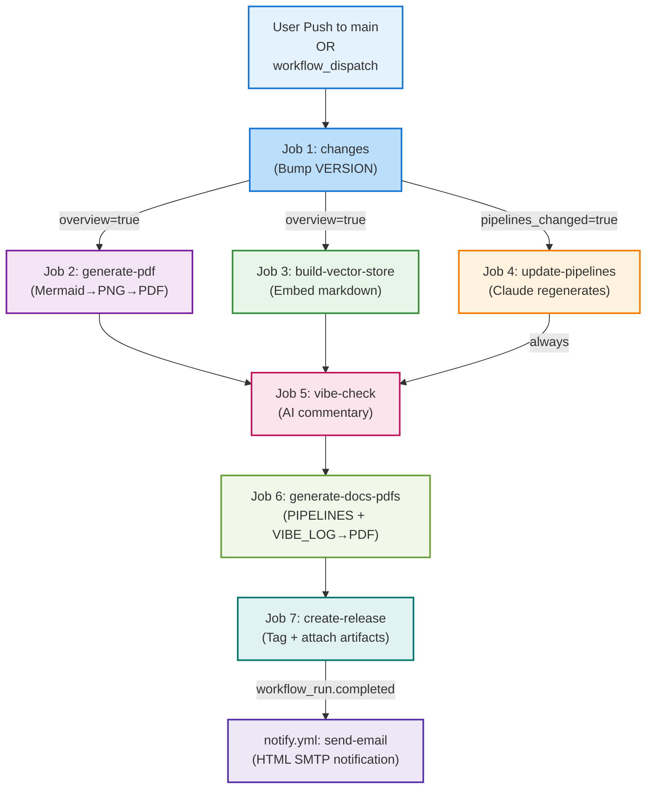

# CI/CD Pipelines — project-propz

This repository runs a fully automated, sequential GitHub Actions CI/CD pipeline with seven integrated jobs spanning two workflows. The pipeline detects changes, bumps versions, regenerates documentation and embeddings, updates pipeline documentation, runs an AI vibe check, generates release PDFs, and creates a GitHub release—all protected by comprehensive loop-prevention guards.

---

## Table of Contents

1. [Overview](#overview)
2. [Pipeline Architecture](#pipeline-architecture)
3. [Architecture Diagram](#architecture-diagram)
4. [Job 1 — Version Bump & Change Detection](#job-1--version-bump--change-detection)
5. [Job 2 — PDF Generation](#job-2--pdf-generation)
6. [Job 3 — RAG Vector Store](#job-3--rag-vector-store)
7. [Job 4 — Auto-Update PIPELINES.md](#job-4--auto-update-pipelinesmd)
8. [Job 5 — AI Vibe Check](#job-5--ai-vibe-check)
9. [Job 6 — Generate Release PDFs](#job-6--generate-release-pdfs)
10. [Job 7 — Create GitHub Release](#job-7--create-github-release)
11. [Notify Workflow](#notify-workflow)
12. [Trigger Matrix](#trigger-matrix)
13. [Secrets Reference](#secrets-reference)
14. [Loop Prevention Strategy](#loop-prevention-strategy)

---

## Overview

The CI/CD system comprises two GitHub Actions workflows:

- **`ci.yml`** — Main pipeline: version detection, PDF/embedding generation, documentation updates, AI review, and release creation
- **`notify.yml`** — Notification handler: sends formatted emails on CI completion

All jobs in `ci.yml` enforce a **no-bot-loop constraint** via `if: github.actor != 'github-actions[bot]'` guards, preventing infinite recursion when the bot commits changes back to the repository. The `notify.yml` workflow runs on `workflow_run` events (not `push`), triggering only after `ci.yml` completes.

---

## Pipeline Architecture

The CI pipeline follows a strictly sequential flow with conditional branching:

```
User Push to main or workflow_dispatch
                    ↓
    ┌───────────────────────────────────┐
    │ Job 1: changes                    │
    │ • Detect file modifications       │
    │ • Bump VERSION (MAJOR/MINOR)      │
    │ • Export: version, overview,      │
    │           pipelines_changed       │
    │ • Commit + push VERSION           │
    └───────────────┬───────────────────┘
                    │
          ┌─────────┴─────────┐
          │                   │
          ▼                   ▼
    [overview=true]   [pipelines_changed=true]
          │                   │
          ▼                   ▼
    Job 2: generate-pdf    Job 4: update-pipelines
    • Mermaid→PNG→PDF      (conditional)
    • Commit PDF           • Claude regenerates
                           • Commits PIPELINES.md
    Job 3: build-vector-store
    • Sentence-transformers
    • Embed markdown chunks
    • Commit vector_store.json
          │
          └─────────────────────┐
                                ▼
                    Job 5: vibe-check
                    • Read original commit
                    • Claude witty review
                    • Append VIBE_LOG.md
                                │
                                ▼
                    Job 6: generate-docs-pdfs
                    • PIPELINES.md→PDF
                    • VIBE_LOG.md→PDF
                    • Upload as artifact
                                │
                                ▼
                    Job 7: create-release
                    • Tag v{VERSION}
                    • Attach PDFs + markdown
                    • gh release create
                                │
                    [workflow completes]
                                │
                                └──────→ notify.yml: send-email
                                         • Build HTML notification
                                         • SMTP to configured address
```

---

## Architecture Diagram



---

## Job 1 — Version Bump & Change Detection

**File:** `.github/workflows/ci.yml`  
**Job ID:** `changes`  
**Runs On:** `ubuntu-latest`  
**Permissions:** `contents: write`  
**Loop Guard:** `if: github.actor != 'github-actions[bot]'`

### Trigger

```yaml
on:
  push:
    branches: [main]
  workflow_dispatch   # manual bootstrap — forces full PDF + RAG rebuild
```

Fires on any push to `main` or manual workflow trigger. Always executes first; exits early if pusher is the bot.

### Bump Rules

| Event | Condition | Action |
|---|---|---|
| `workflow_dispatch` | (any) | MINOR + 1; OVERVIEW_CHANGED=false |
| `push` | `PROJECT_OVERVIEW.md` changed | MAJOR + 1, MINOR→0; OVERVIEW_CHANGED=true |
| `push` | `.github/workflows/*` or `.github/scripts/*` changed | MINOR + 1; PIPELINES_CHANGED=true |
| `push` | Other files changed | MINOR + 1 |

### Key Logic

```bash
# Read current version
CURRENT=$(cat VERSION 2>/dev/null || echo "1.0")
MAJOR=$(echo "$CURRENT" | cut -d. -f1)
MINOR=$(echo "$CURRENT" | cut -d. -f2)

# Detect changes
if [[ "${{ github.event_name }}" == "workflow_dispatch" ]]; then
  OVERVIEW_CHANGED=true
  PIPELINES_CHANGED=false
  NEW_VERSION="${MAJOR}.$((MINOR + 1))"
else
  CHANGED=$(git diff --name-only HEAD~1 HEAD 2>/dev/null || echo "")
  OVERVIEW_CHANGED=false
  PIPELINES_CHANGED=false

  echo "$CHANGED" | grep -q '^PROJECT_OVERVIEW\.md$'         && OVERVIEW_CHANGED=true
  echo "$CHANGED" | grep -qE '^\.github/(workflows|scripts)/' && PIPELINES_CHANGED=true

  if [[ "$OVERVIEW_CHANGED" == "true" ]]; then
    NEW_VERSION="$((MAJOR + 1)).0"
  else
    NEW_VERSION="${MAJOR}.$((MINOR + 1))"
  fi
fi

# Commit VERSION with [skip ci] to prevent infinite loop
echo "$NEW_VERSION" > VERSION
git config user.name "github-actions[bot]"
git config user.email "github-actions[bot]@users.noreply.github.com"
git add VERSION
git diff --staged --quiet || git commit -m "chore(version): bump to v${NEW_VERSION} [skip ci]"
git push

# Export for downstream consumption
echo "version=${NEW_VERSION}" >> "$GITHUB_OUTPUT"
echo "overview=${OVERVIEW_CHANGED}" >> "$GITHUB_OUTPUT"
echo "pipelines_changed=${PIPELINES_CHANGED}" >> "$GITHUB_OUTPUT"
```

### Output Artifacts

| Output | Type | Example | Consumed By |
|---|---|---|---|
| `version` | String | `1.3` | Jobs 2–7, release tag |
| `overview` | Boolean | `true` / `false` | Jobs 2, 3 (conditional gate) |
| `pipelines_changed` | Boolean | `true` / `false` | Job 4 (conditional gate) |

---

## Job 2 — PDF Generation

**File:** `.github/workflows/ci.yml`  
**Job ID:** `generate-pdf`  
**Runs On:** `ubuntu-latest`  
**Permissions:** `contents: write`  
**Input:** `PROJECT_OVERVIEW.md`  
**Output:** `PROJECT_OVERVIEW.pdf` (committed to repo)

### Trigger

```yaml
needs: changes
if: needs.changes.outputs.overview == 'true'
```

Conditional execution only when the overview document changes. Skipped for routine code commits.

### Steps

1. **Checkout** — `actions/checkout@v4` with `GITHUB_TOKEN`
2. **Pull latest** — `git pull --rebase origin main` (picks up VERSION bump from Job 1)
3. **Install LaTeX stack** — pandoc, texlive-xetex, texlive-fonts-recommended, texlive-plain-generic, fonts-dejavu
4. **Setup Node.js 20** and `npm install -g @mermaid-js/mermaid-cli`
5. **Convert Mermaid diagrams to PNG** — embedded Python script finds all ` ```mermaid ``` ` blocks, extracts, renders via mmdc
6. **Generate PDF** — pandoc with XeLaTeX engine processes `PROJECT_OVERVIEW_processed.md`
7. **Commit + push** — VCS stores `PROJECT_OVERVIEW.pdf` with `[skip ci]` tag

### Mermaid-to-PDF Pipeline

**Step 5 Python Logic:**

```python
import re, subprocess, sys
from pathlib import Path

content = Path('PROJECT_OVERVIEW.md').read_text(encoding='utf-8')
pattern = r'```mermaid\n(.*?)\n```'
matches = list(re.finditer(pattern, content, re.DOTALL))

if not matches:
    Path('PROJECT_OVERVIEW_processed.md').write_text(content)
    sys.exit(0)

for i, match in enumerate(matches):
    mmd_file = f'diagram_{i}.mmd'
    png_file = f'diagram_{i}.png'
    
    Path(mmd_file).write_text(match.group(1), encoding='utf-8')
    
    result = subprocess.run(
        ['mmdc', '-i', mmd_file, '-o', png_file,
         '--puppeteerConfigFile', 'puppeteer-config.json'],
        capture_output=True, text=True
    )
    
    if result.returncode != 0:
        print(f"Error: {result.stderr}", file=sys.stderr)
        sys.exit(1)
    
    content = content.replace(match.group(0), f'', 1)

Path('PROJECT_OVERVIEW_processed.md').write_text(content, encoding='utf-8')
```

**Puppeteer config** (suppresses sandbox errors on GitHub runners):

```json
{"args": ["--no-sandbox", "--disable-setuid-sandbox"]}
```

### pandoc Configuration

```bash
pandoc PROJECT_OVERVIEW_processed.md \
  --pdf-engine=xelatex \
  --toc \
  -V geometry:margin=1in \
  -V fontsize=11pt \
  -V mainfont="DejaVu Sans" \
  -V monofont="DejaVu Sans Mono" \
  -o PROJECT_OVERVIEW.pdf
```

**Rationale:**  
- **XeLaTeX** — Native UTF-8 support, system font integration  
- **DejaVu Sans/Mono** — Monospace rendering, widely available  
- **Margin/fontsize** — Professional 1-inch margins, 11pt body text  
- **TOC** — Auto-generated from markdown headers

### Artifacts

| File | Type | Status |
|---|---|---|
| `diagram_N.mmd` | Ephemeral | Cleaned automatically |
| `diagram_N.png` | Ephemeral | Embedded in PDF only |
| `PROJECT_OVERVIEW_processed.md` | Ephemeral | Working file |
| **`PROJECT_OVERVIEW.pdf`** | **Committed** | Attached to release |

---

## Job 3 — RAG Vector Store

**File:** `.github/workflows/ci.yml`  
**Job ID:** `build-vector-store`  
**Runs On:** `ubuntu-latest`  
**Permissions:** `contents: write`  
**Script:** `.github/scripts/build_embeddings.py`  
**Input:** `PROJECT_OVERVIEW.md`  
**Output:** `chat/vector_store.json` (committed to repo)  
**Gating:** `vars.CHAT_ENABLED == 'true'`

### Trigger

```yaml
needs: [changes, generate-pdf]
if: needs.changes.outputs.overview == 'true' && vars.CHAT_ENABLED == 'true'
```

Conditional execution when overview changes **and** the chat feature is enabled (repository variable). Allows disabling the vector store rebuild when the Streamlit doc-chat is offline.

### Steps

1. **Checkout** — `actions/checkout@v4` with `GITHUB_TOKEN`
2. **Pull latest** — `git pull --rebase origin main` (picks up PDF if Job 2 ran)
3. **Setup Python 3.11** — `actions/setup-python@v5`
4. **Cache Hugging Face models** — `~/.cache/huggingface` (key: `hf-${{ runner.os }}-all-MiniLM-L6-v2`)
5. **Install dependencies** — `pip install sentence-transformers numpy`
6. **Build vector store** — `python .github/scripts/build_embeddings.py`
7. **Commit + push** — VCS stores `chat/vector_store.json` with `[skip ci]` tag

### Chunking Strategy

**Script:** `.github/scripts/build_embeddings.py`

```python
def chunk_markdown(text: str) -> list[str]:
    """Split markdown at H1/H2/H3 boundaries, then by paragraph for long chunks."""
    pattern = r'(?=^#{1,3} )'
    raw_chunks = re.split(pattern, text, flags=re.MULTILINE)
    
    chunks = []
    for raw in raw_chunks:
        raw = raw.strip()
        if not raw or len(raw) < 60:
            continue
        
        if len(raw) <= CHUNK_MAX_CHARS:  # 1200 chars
            chunks.append(raw)
            continue
        
        # Split long chunks at blank-line boundaries
        current = ""
        for para in re.split(r"\n{2,}", raw):
            if len(current) + len(para) > CHUNK_MAX_CHARS and current:
                chunks.append(current.strip())
                current = para
            else:
                current = (current + "\n\n" + para) if current
