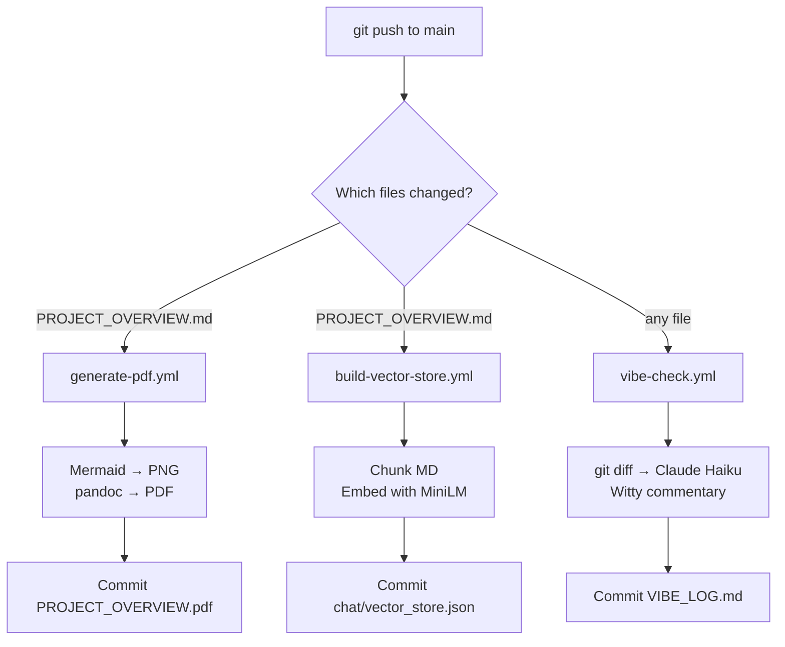

# CI/CD Pipelines — project-propz

This repository runs three fully automated GitHub Actions pipelines, each with a distinct responsibility. All pipelines are self-contained, write back to the repository, and include loop-prevention guards so their own commits never re-trigger downstream jobs.

---

## Table of Contents

1. [Overview](#overview)
2. [Pipeline 1 — PDF Generation](#pipeline-1--pdf-generation)
3. [Pipeline 2 — AI Vibe Check](#pipeline-2--ai-vibe-check)
4. [Pipeline 3 — RAG Vector Store](#pipeline-3--rag-vector-store)
5. [Trigger Matrix](#trigger-matrix)
6. [Secrets Reference](#secrets-reference)
7. [Loop Prevention Strategy](#loop-prevention-strategy)

---

## Overview



---

## Pipeline 1 — PDF Generation

**File:** `.github/workflows/generate-pdf.yml`

### Responsibility

Converts `PROJECT_OVERVIEW.md` into a print-ready PDF and commits it back to the repository. Mermaid code blocks (```` ```mermaid ```` ) are rendered to high-resolution PNGs before the PDF is assembled, so diagrams appear as proper images rather than raw code.

### Trigger

```
push → main
  paths: PROJECT_OVERVIEW.md
```

Only fires when the source document actually changes. Unrelated commits (code, config, bot commits) do not trigger it.

### Steps

```
1. Checkout (with write token)
2. Install pandoc + XeLaTeX (texlive-xetex)
3. Set up Node.js 20
4. Install @mermaid-js/mermaid-cli (mmdc)
5. Convert Mermaid diagrams → PNG
6. pandoc → PROJECT_OVERVIEW.pdf
7. git commit + push [skip ci]
```

### Mermaid Conversion Detail

An inline Python script handles the conversion:

1. Reads `PROJECT_OVERVIEW.md` and finds all ` ```mermaid ``` ` blocks via regex
2. Writes each block to a temporary `.mmd` file
3. Calls `mmdc` with a Puppeteer config that sets `--no-sandbox` (required in GitHub Actions' sandboxed environment)
4. Replaces the code block in the markdown with ``
5. Writes the processed file to `PROJECT_OVERVIEW_processed.md`

If no Mermaid blocks are found, the original file is passed through unchanged.

### pandoc Configuration

```bash
pandoc PROJECT_OVERVIEW_processed.md \
  --pdf-engine=xelatex \
  --toc \
  -V geometry:margin=1in \
  -V fontsize=11pt \
  -V mainfont="DejaVu Sans" \
  -o PROJECT_OVERVIEW.pdf
```

XeLaTeX is used over pdflatex because it supports system fonts (DejaVu Sans) and handles UTF-8 natively.

### Output

| Artifact | Location | Committed |
|---|---|---|
| Processed markdown | `PROJECT_OVERVIEW_processed.md` | No (ephemeral) |
| Diagram images | `diagram_0.png`, `diagram_1.png`, … | No (ephemeral) |
| Final PDF | `PROJECT_OVERVIEW.pdf` | **Yes** |

---

## Pipeline 2 — AI Vibe Check

**File:** `.github/workflows/vibe-check.yml`  
**Script:** `.github/scripts/vibe_check.py`

### Responsibility

After every push to `main`, reads the latest commit message and diff, sends them to **Claude Haiku** (Anthropic), and receives a short, personality-driven micro-review. The review is prepended to `VIBE_LOG.md` so the most recent entry is always at the top.

### Trigger

```
push → main
  (all files — no path filter)
```

Runs on every push regardless of which files changed. The bot's own commits are excluded via a job-level condition.

### Loop Prevention

Two independent guards prevent the bot from reviewing its own commits:

1. `if: github.actor != 'github-actions[bot]'` — job-level condition evaluated before the job starts; skips the entire job if the pusher is the Actions bot
2. `[skip ci]` in the commit message — GitHub's native mechanism that prevents any workflow from running on that commit

Both guards must be defeated simultaneously for a loop to occur.

### Steps

```
1. Checkout (fetch-depth: 2 — required for git diff HEAD~1)
2. Set up Python 3.11
3. pip install anthropic
4. Run vibe_check.py (ANTHROPIC_API_KEY injected as env var)
5. git commit VIBE_LOG.md + push [skip ci]
```

### Script Logic (`vibe_check.py`)

```
get_commit_info()
  ├── git log -1 --pretty=%B        → commit message
  ├── git log -1 --pretty=%an       → author name
  ├── git diff --name-only HEAD~1   → changed file list
  └── git diff HEAD~1 HEAD          → full diff
        (excludes *.pdf *.png *.ttf etc.)
        (truncated at 150 lines to limit token cost)

call_claude()
  └── claude-haiku-4-5
        system: VibeBot persona
        user:   commit message + author + files + diff
        max_tokens: 256

update_vibe_log()
  ├── reads existing VIBE_LOG.md (or initialises it)
  └── prepends new entry after the header separator
```

### VIBE_LOG.md Format

```markdown
# VIBE_LOG

*Automated AI commentary on every commit. Powered by VibeBot + Claude Haiku.*

---

## 15 April 2026, 14:32 UTC

**Commit:** `feat: add RAG pipeline`
**Author:** Antonio Caruso

> You just bolted a vector store onto a board game repo. Respect.
> The chunking logic is clean and the cosine similarity is textbook — 9/10 — Unhinged Efficiency.

---
```

### Cost

Claude Haiku at $1/5 per 1M tokens. A typical vibe check (150-line diff + response) costs well under $0.001.

---

## Pipeline 3 — RAG Vector Store

**File:** `.github/workflows/build-vector-store.yml`  
**Script:** `.github/scripts/build_embeddings.py`  
**Consumer:** `chat/app.py` (Streamlit)

### Responsibility

Whenever `PROJECT_OVERVIEW.md` changes, this pipeline re-indexes it into a vector store and commits the result to `chat/vector_store.json`. The Streamlit Doc-Chat app reads this file at startup to answer questions about the project using Retrieval-Augmented Generation.

### Trigger

```
push → main
  paths: PROJECT_OVERVIEW.md

workflow_dispatch   ← manual trigger for first-run bootstrap
```

`workflow_dispatch` is included because `vector_store.json` doesn't exist on the first clone — run it once manually from the Actions tab to bootstrap.

### Steps

```
1. Checkout (with write token)
2. Set up Python 3.11
3. Cache ~/.cache/huggingface (key: all-MiniLM-L6-v2)
4. pip install sentence-transformers numpy
5. python build_embeddings.py
6. git commit chat/vector_store.json + push [skip ci]
```

The Hugging Face cache key is pinned to the model name. Once downloaded on the first run (~90 MB), subsequent runs restore from cache and skip the download entirely.

### Chunking Strategy (`build_embeddings.py`)

```
PROJECT_OVERVIEW.md
  │
  ├── Split at H1/H2/H3 headers (regex: (?=^#{1,3} ))
  │     Each section becomes one candidate chunk
  │
  └── Long chunks (> 1200 chars) split further at blank lines
        Prevents individual chunks from overwhelming the context window
        in the Streamlit app
```

Chunks shorter than 60 characters (e.g. empty sections, pure separators) are discarded.

### Embedding Model

| Property | Value |
|---|---|
| Model | `all-MiniLM-L6-v2` |
| Dimensions | 384 |
| Normalization | L2 (pre-normalized at build time) |
| Source | Hugging Face via `sentence-transformers` |
| Cost | Free — runs entirely on the CI runner, no API call |

Pre-normalizing embeddings means similarity at query time is a plain dot product (`np.dot`) rather than a full cosine computation.

### `vector_store.json` Schema

```json
{
  "model": "all-MiniLM-L6-v2",
  "generated_at": "2026-04-15T14:00:00+00:00",
  "source": "PROJECT_OVERVIEW.md",
  "chunks": [
    {
      "id": 0,
      "text": "## 1. The Game\n\nPropaganza is a satirical...",
      "embedding": [0.042, -0.118, 0.033, ...]
    }
  ]
}
```

Typical file size: ~120–200 KB for a 500-line markdown document.

### RAG Query Flow (Streamlit App)

```
User question
  │
  ├── Embed with all-MiniLM-L6-v2 (same model, loaded at startup)
  │
  ├── Dot-product similarity against all chunk embeddings
  │     → top 4 chunks selected
  │
  └── Claude Haiku
        system: grounded assistant persona
        user:   [4 chunks] + [question]
        max_tokens: 1024
        → answer grounded in the documentation
```

The top-K value (4) is a balance between context richness and staying within Haiku's context window.

---

## Trigger Matrix

| Event | `generate-pdf.yml` | `vibe-check.yml` | `build-vector-store.yml` |
|---|:---:|:---:|:---:|
| Push `PROJECT_OVERVIEW.md` | ✅ | ✅ | ✅ |
| Push any other file | ❌ | ✅ | ❌ |
| Bot commits `[skip ci]` | ❌ | ❌ | ❌ |
| Manual `workflow_dispatch` | ❌ | ❌ | ✅ |

When `PROJECT_OVERVIEW.md` is pushed, all three pipelines fire simultaneously and in parallel. Each writes back a different artifact under its own `[skip ci]` commit, so they do not chain into each other.

---

## Secrets Reference

| Secret | Used by | Purpose |
|---|---|---|
| `GITHUB_TOKEN` | All pipelines | Write access to commit artifacts back to the repo (auto-provided by GitHub) |
| `ANTHROPIC_API_KEY` | `vibe-check.yml`, `chat/app.py` | Claude Haiku API calls |

No secrets are required for the PDF or vector store pipelines beyond the standard `GITHUB_TOKEN`.

---

## Loop Prevention Strategy

All three pipelines write back to the repository. Without guards, each bot commit would re-trigger the pipelines in an infinite loop. Two complementary mechanisms prevent this:

### `[skip ci]` in commit messages

GitHub natively skips all workflow runs for commits whose message contains `[skip ci]`. Every bot commit in this repo uses this suffix:

```
chore: regenerate PROJECT_OVERVIEW.pdf [skip ci]
chore(vibe): AI vibe check [skip ci]
chore(rag): rebuild vector store [skip ci]
```

### `if: github.actor != 'github-actions[bot]'`

Used additionally in `vibe-check.yml` as a job-level condition. This guard fires before the job even starts, adding a second layer of protection independent of the commit message.

### Why both?

`[skip ci]` prevents all workflows. The actor check prevents only the vibe check. Using both means the vibe check pipeline has two independent failure modes for the loop to exploit — which in practice makes it impossible.
