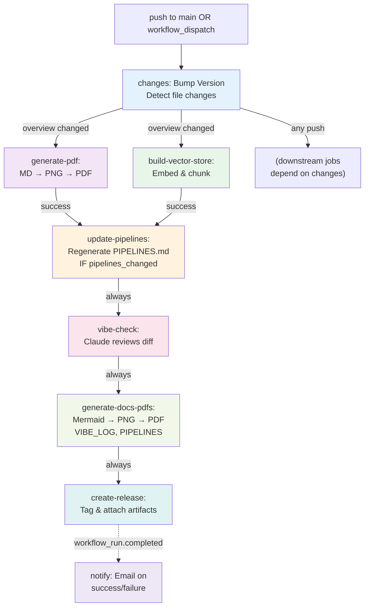

# CI/CD Pipelines — project-propz

This repository runs a fully automated, sequential GitHub Actions CI/CD pipeline with seven integrated jobs. The pipeline detects changes, bumps versions, regenerates documentation and embeddings, updates pipeline documentation, runs an AI vibe check, generates release PDFs, and creates a GitHub release—all protected by comprehensive loop-prevention guards.

---

## Table of Contents

1. [Overview](#overview)
2. [Pipeline Architecture](#pipeline-architecture)
3. [Job 1 — Version Bump & Change Detection](#job-1--version-bump--change-detection)
4. [Job 2 — PDF Generation](#job-2--pdf-generation)
5. [Job 3 — RAG Vector Store](#job-3--rag-vector-store)
6. [Job 4 — Auto-Update PIPELINES.md](#job-4--auto-update-pipelinesmd)
7. [Job 5 — AI Vibe Check](#job-5--ai-vibe-check)
8. [Job 6 — Generate Release PDFs](#job-6--generate-release-pdfs)
9. [Job 7 — Create GitHub Release](#job-7--create-github-release)
10. [Notify Workflow](#notify-workflow)
11. [Trigger Matrix](#trigger-matrix)
12. [Secrets Reference](#secrets-reference)
13. [Loop Prevention Strategy](#loop-prevention-strategy)

---

## Overview



---

## Pipeline Architecture

The CI workflow (`ci.yml`) is **sequential but optimized**: jobs wait for their dependencies, but parallel execution is maximized where possible. The key principle is that **every job commits back to the repository**, so each downstream job uses `git pull --rebase` to pick up upstream commits before running.

**Execution order:**

1. `changes` — first job, always runs (unless pusher is bot)
2. `generate-pdf` + `build-vector-store` — parallel, if overview changed
3. `update-pipelines` — after PDF + vector store, if pipeline files changed
4. `vibe-check` — always, depends on all prior jobs
5. `generate-docs-pdfs` — always, depends on vibe check
6. `create-release` — always, depends on everything
7. `notify` (separate workflow) — triggered after CI completes

**Key constraint:** All jobs run on `ubuntu-latest` with `contents: write` permissions to commit artifacts. The `GITHUB_TOKEN` is automatically provisioned and rotated by GitHub.

---

## Job 1 — Version Bump & Change Detection

**File:** `.github/workflows/ci.yml` → `changes` job

### Responsibility

Runs first on every push. Reads the current `VERSION` file, detects which files changed, bumps the version according to rules, and commits the new version so downstream jobs always pull a clean, versioned tip.

### Trigger

```yaml
on:
  push:
    branches: [main]
  workflow_dispatch
```

Runs on any push to `main` or manual trigger. Skips if the pusher is `github-actions[bot]` (via `if: github.actor != 'github-actions[bot]'`).

### Bump Rules

| Condition | Bump Rule |
|---|---|
| `workflow_dispatch` (manual trigger) | MINOR + 1 (triggers full rebuild) |
| `PROJECT_OVERVIEW.md` changed | MAJOR + 1, reset MINOR to 0 |
| Any other file changed | MINOR + 1 |

### Steps

```
1. Checkout with fetch-depth: 2 (needed for git diff HEAD~1)
2. Detect file changes via git diff HEAD~1 HEAD
3. Parse current VERSION (default 1.0 if missing)
4. Calculate new version per bump rules
5. Write new VERSION file
6. git config + git commit [skip ci] + git push
```

### Key Logic

```bash
# Determine what changed
if workflow_dispatch:
  OVERVIEW_CHANGED = false (manual trigger treats as full rebuild)
  PIPELINES_CHANGED = false
  NEW_VERSION = MAJOR.MINOR+1
else
  git diff --name-only HEAD~1 HEAD
  grep for PROJECT_OVERVIEW.md → OVERVIEW_CHANGED
  grep for .github/(workflows|scripts)/ → PIPELINES_CHANGED
  
  if OVERVIEW_CHANGED:
    NEW_VERSION = MAJOR+1.0
  else:
    NEW_VERSION = MAJOR.MINOR+1
```

### Outputs

| Output | Example | Used By |
|---|---|---|
| `version` | `1.3` | All downstream jobs, release creation |
| `overview` | `true` / `false` | PDF, vector store (conditional trigger) |
| `pipelines_changed` | `true` / `false` | Update PIPELINES (conditional trigger) |

---

## Job 2 — PDF Generation

**File:** `.github/workflows/ci.yml` → `generate-pdf` job  
**Input:** `PROJECT_OVERVIEW.md`  
**Output:** `PROJECT_OVERVIEW.pdf`

### Responsibility

Converts `PROJECT_OVERVIEW.md` into a print-ready PDF with embedded diagram images. All Mermaid code blocks are rendered to high-resolution PNGs via `@mermaid-js/mermaid-cli` before pandoc assembles the PDF.

### Trigger

```yaml
needs: changes
if: needs.changes.outputs.overview == 'true'
```

Only runs if `changes` job detected `PROJECT_OVERVIEW.md` changed. Skipped for other pushes.

### Steps

```
1. Checkout (with GITHUB_TOKEN for potential writes)
2. git pull --rebase origin main (picks up VERSION bump from changes job)
3. Install pandoc + texlive-xetex + texlive-fonts-recommended
4. Set up Node.js 20
5. npm install -g @mermaid-js/mermaid-cli
6. Convert all ```mermaid``` blocks → PNG
7. pandoc PROJECT_OVERVIEW_processed.md → PDF
8. git commit PROJECT_OVERVIEW.pdf [skip ci] + push
```

### Mermaid Conversion Detail

An embedded Python script:

1. Reads `PROJECT_OVERVIEW.md`, finds all ` ```mermaid ``` ` blocks via regex `r'```mermaid\n(.*?)\n```'`
2. Writes each block to a temporary `.mmd` file
3. Calls `mmdc -i diagram_N.mmd -o diagram_N.png --puppeteerConfigFile puppeteer-config.json`
4. Replaces the code block with ``
5. Writes result to `PROJECT_OVERVIEW_processed.md`
6. If no Mermaid blocks found, passes original through unchanged

Puppeteer config suppresses sandbox errors in GitHub's runner:
```json
{"args": ["--no-sandbox", "--disable-setuid-sandbox"]}
```

### pandoc Configuration

```bash
pandoc PROJECT_OVERVIEW_processed.md \
  --pdf-engine=xelatex \
  --toc \
  -V geometry:margin=1in \
  -V fontsize=11pt \
  -V mainfont="DejaVu Sans" \
  -o PROJECT_OVERVIEW.pdf
```

XeLaTeX is chosen for native UTF-8 support and system font access.

### Artifacts

| File | Status | Purpose |
|---|---|---|
| `diagram_N.mmd` | Ephemeral | Temporary Mermaid source |
| `diagram_N.png` | Ephemeral | Temporary diagram image |
| `PROJECT_OVERVIEW_processed.md` | Ephemeral | Intermediate markdown |
| `PROJECT_OVERVIEW.pdf` | **Committed** | Final deliverable |

---

## Job 3 — RAG Vector Store

**File:** `.github/workflows/ci.yml` → `build-vector-store` job  
**Script:** `.github/scripts/build_embeddings.py`  
**Input:** `PROJECT_OVERVIEW.md`  
**Output:** `chat/vector_store.json`

### Responsibility

Chunks `PROJECT_OVERVIEW.md` at semantic boundaries (headers), embeds each chunk with `all-MiniLM-L6-v2` via sentence-transformers, and commits a JSON vector store for use by the Streamlit Doc-Chat app.

### Trigger

```yaml
needs: [changes, generate-pdf]
if: needs.changes.outputs.overview == 'true'
```

Runs after PDF generation completes (picks up VERSION), only if overview changed.

### Steps

```
1. Checkout (with GITHUB_TOKEN)
2. git pull --rebase origin main (picks up all prior commits)
3. Set up Python 3.11
4. Cache ~/.cache/huggingface (key: hf-ubuntu-all-MiniLM-L6-v2)
5. pip install sentence-transformers numpy
6. python .github/scripts/build_embeddings.py
7. git commit chat/vector_store.json [skip ci] + push
```

### Chunking Strategy

**Input:** Raw `PROJECT_OVERVIEW.md`

```
1. Split at H1/H2/H3 header boundaries (regex: (?=^#{1,3} ))
   └─ Each section becomes a candidate chunk

2. Filter chunks < 60 characters (empty/separator blocks)

3. Split long chunks (> 1200 chars) further at blank lines
   └─ Prevents individual chunks from overwhelming embedding context
```

**Output:** List of semantic chunks, each ~ 200–1200 characters.

### Embedding

```python
model = SentenceTransformer('all-MiniLM-L6-v2')
embeddings = model.encode(chunks, normalize_embeddings=True)
# Result: N × 384 array, each row L2-normalized
```

| Property | Value |
|---|---|
| Model | `all-MiniLM-L6-v2` from Hugging Face |
| Dimensions | 384 |
| Normalization | L2 (pre-normalized) |
| Cost | Free (runs on CI runner, no API call) |
| Cache | ~/.cache/huggingface (~90 MB after first run) |

### `vector_store.json` Schema

```json
{
  "model": "all-MiniLM-L6-v2",
  "generated_at": "2026-04-15T14:32:00+00:00",
  "source": "PROJECT_OVERVIEW.md",
  "chunks": [
    {
      "id": 0,
      "text": "## Overview\n\nThis repository...",
      "embedding": [0.042, -0.118, 0.033, ...]
    }
  ]
}
```

Typical size: 120–200 KB for a 500-line markdown document.

### RAG Query Flow

```
User: "What is the game?"
  ↓
Embed query with all-MiniLM-L6-v2 (same model, loaded at app startup)
  ↓
Dot-product similarity: query_embedding · chunk_embedding[T]
  ↓
Select top 4 chunks (by score)
  ↓
Send to Claude Haiku:
  system: "You are a helpful assistant grounded in documentation."
  user: "[4 chunks] + [question]"
  max_tokens: 1024
  ↓
Return grounded answer
```

---

## Job 4 — Auto-Update PIPELINES.md

**File:** `.github/workflows/ci.yml` → `update-pipelines` job  
**Script:** `.github/scripts/update_pipelines.py`

### Responsibility

Whenever `.github/workflows/` or `.github/scripts/` files change, this job reads all `.yml` and `.py` files, sends them to Claude Haiku with a detailed system prompt, and regenerates `PIPELINES.md` to keep documentation always in sync with actual code.

### Trigger

```yaml
needs: [changes, generate-pdf, build-vector-store]
if: >-
  always() &&
  github.actor != 'github-actions[bot]' &&
  needs.changes.result == 'success' &&
  needs.changes.outputs.pipelines_changed == 'true'
```

Runs only if:
- `changes` job succeeded
- `pipelines_changed` output is `true`
- Pusher is not the bot

### Steps

```
1. Checkout (with GITHUB_TOKEN)
2. git pull --rebase origin main (picks up all prior commits)
3. Set up Python 3.11
4. pip install anthropic
5. python .github/scripts/update_pipelines.py (ANTHROPIC_API_KEY injected)
6. git commit PIPELINES.md [skip ci] + push
```

### Script Logic

```python
# Read all workflow and script files
workflows_text = read_dir(".github/workflows", "*.yml")
scripts_text = read_dir(".github/scripts", "*.py")
current_doc = PIPELINES.md.read()  # for style reference

# Send to Claude
client.messages.create(
  model="claude-haiku-4-5",
  max_tokens=4096,
  system="""
    You are a technical writer maintaining PIPELINES.md...
    Given the actual workflow YAML files and Python scripts, 
    produce a complete, accurate PIPELINES.md that includes:
    1. A Mermaid overview diagram...
    2. One detailed section per pipeline...
    3. A trigger matrix table...
    4. A secrets reference table...
    5. A loop-prevention strategy section...
    
    Style: match the depth and voice of the existing document.
    Output ONLY raw Markdown. No preamble, no explanation.
  """,
  messages=[{
    "role": "user",
    "content": f"## Current workflow files\n\n{workflows_text}\n\n## Current CI scripts\n\n{scripts_text}\n\n## Existing PIPELINES.md (for style reference)\n\n{current_doc}\n\nWrite the updated PIPELINES.md now."
  }]
)

# Write response to PIPELINES.md
PIPELINES.md.write(response.content[0].text.strip() + "\n")
```

### Cost

Claude Haiku at ~$0.80 per 1M input tokens, ~$4 per 1M output tokens. A typical invocation (5 KB workflow files + 4 KB existing doc → 4 KB updated doc) costs well under $0.01.

### Output

| File | Status |
|---|---|
| `PIPELINES.md` | **Committed** |

---

## Job 5 — AI Vibe Check

**File:** `.github/workflows/ci.yml` → `vibe-check` job  
**Script:** `.github/scripts/vibe_check.py`

### Responsibility

After every push, reads the original user commit's message and diff, sends them to Claude Haiku with a personality prompt, and prepends a witty micro-review to `VIBE_LOG.md`.

### Trigger

```yaml
needs: [changes, generate-pdf, build-vector-store, update-pipelines]
if
