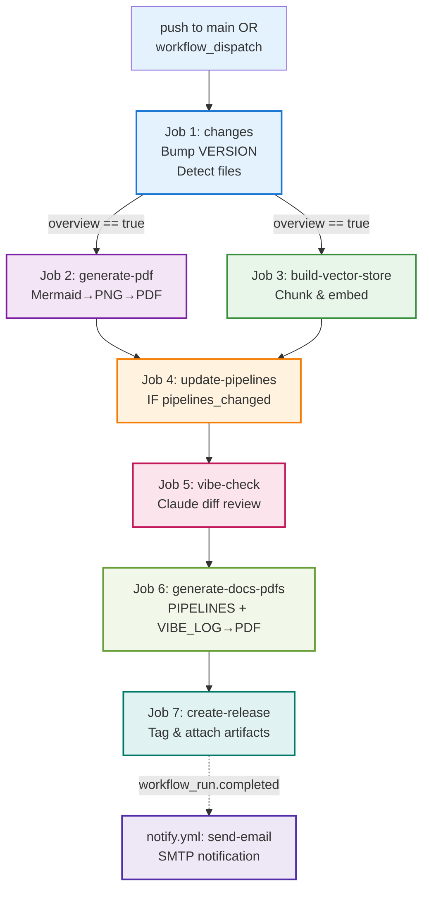

# CI/CD Pipelines — project-propz

This repository runs a fully automated, sequential GitHub Actions CI/CD pipeline with seven integrated jobs spanning two workflows. The pipeline detects changes, bumps versions, regenerates documentation and embeddings, updates pipeline documentation, runs an AI vibe check, generates release PDFs, and creates a GitHub release—all protected by comprehensive loop-prevention guards.

---

## Table of Contents

1. [Overview](#overview)
2. [Pipeline Architecture](#pipeline-architecture)
3. [Mermaid Architecture Diagram](#mermaid-architecture-diagram)
4. [Job 1 — Version Bump & Change Detection](#job-1--version-bump--change-detection)
5. [Job 2 — PDF Generation](#job-2--pdf-generation)
6. [Job 3 — RAG Vector Store](#job-3--rag-vector-store)
7. [Job 4 — Auto-Update PIPELINES.md](#job-4--auto-update-pipelinesmd)
8. [Job 5 — AI Vibe Check](#job-5--ai-vibe-check)
9. [Job 6 — Generate Release PDFs](#job-6--generate-release-pdfs)
10. [Job 7 — Create GitHub Release](#job-7--create-github-release)
11. [Notify Workflow](#notify-workflow)
12. [Trigger Matrix](#trigger-matrix)
13. [Secrets Reference](#secrets-reference)
14. [Loop Prevention Strategy](#loop-prevention-strategy)

---

## Overview

The CI/CD system comprises two GitHub Actions workflows:

- **`ci.yml`** — Main pipeline: version detection, PDF/embedding generation, documentation updates, AI review, and release creation
- **`notify.yml`** — Notification handler: sends formatted emails on CI completion

All jobs enforce a **no-bot-loop constraint** via `if: github.actor != 'github-actions[bot]'` guards, preventing infinite recursion when the bot commits changes back to the repository.

---

## Pipeline Architecture

```
┌─────────────────────────────────────────────────────────────────┐
│ Trigger: push to main OR workflow_dispatch                      │
└────────────────────────┬────────────────────────────────────────┘
                         │
                         ▼
        ┌────────────────────────────────┐
        │ Job 1: changes                 │
        │ • Detect file changes          │
        │ • Bump VERSION                 │
        │ • Commit + push                │
        └────┬────────────┬──────────────┘
             │            │
     overview│ changed    │ pipelines_changed
             │            │
             ▼            ▼
    ┌──────────────┐  ┌─────────────┐
    │ Job 2: PDF   │  │ Job 3: RAG  │  (parallel if overview=true)
    │ • Mermaid→   │  │ • Embed     │
    │   PNG→PDF    │  │ • Chunks    │
    │ • Commit     │  │ • Commit    │
    └──────┬───────┘  └─────┬───────┘
           │                │
           └────────┬───────┘
                    │ (both success or skip)
                    ▼
        ┌──────────────────────────────┐
        │ Job 4: update-pipelines      │
        │ (only if pipelines_changed)  │
        │ • Read .github/*.yml/py      │
        │ • Claude → regenerate        │
        │   PIPELINES.md               │
        │ • Commit                     │
        └────────┬─────────────────────┘
                 │
                 ▼
        ┌──────────────────────────────┐
        │ Job 5: vibe-check            │
        │ • Read original commit diff  │
        │ • Claude → witty review      │
        │ • Append VIBE_LOG.md         │
        │ • Commit                     │
        └────────┬─────────────────────┘
                 │
                 ▼
        ┌──────────────────────────────┐
        │ Job 6: generate-docs-pdfs    │
        │ • Mermaid→PNG in PIPELINES   │
        │ • pandoc → PIPELINES.pdf     │
        │ • pandoc → VIBE_LOG.pdf      │
        │ • Upload as artifact (1 day) │
        └────────┬─────────────────────┘
                 │
                 ▼
        ┌──────────────────────────────┐
        │ Job 7: create-release        │
        │ • Download ephemeral PDFs    │
        │ • Tag v{VERSION}             │
        │ • Attach .md + .pdf files    │
        │ • gh release create          │
        └──────────────────────────────┘
                 │
                 ▼ (workflow_run.completed event)
        ┌──────────────────────────────┐
        │ notify.yml: send-email       │
        │ • Build HTML body            │
        │ • SMTP → email notification  │
        └──────────────────────────────┘
```

---

## Mermaid Architecture Diagram



---

## Job 1 — Version Bump & Change Detection

**File:** `.github/workflows/ci.yml`  
**Job ID:** `changes`  
**Key Outputs:** `version`, `overview`, `pipelines_changed`

### Trigger

```yaml
on:
  push:
    branches: [main]
  workflow_dispatch
```

Fires on any push to `main` or manual trigger. **Always runs first**, but exits early if the pusher is `github-actions[bot]`.

### Bump Rules

| Condition | Action |
|---|---|
| `workflow_dispatch` (manual trigger) | MINOR + 1; OVERVIEW_CHANGED=false, PIPELINES_CHANGED=false |
| `PROJECT_OVERVIEW.md` changed | MAJOR + 1, MINOR reset to 0; OVERVIEW_CHANGED=true |
| `.github/workflows/*` or `.github/scripts/*` changed | MINOR + 1; PIPELINES_CHANGED=true |
| All other changes | MINOR + 1 |

### Key Steps

```bash
# 1. Read current version
CURRENT=$(cat VERSION 2>/dev/null || echo "1.0")
MAJOR=$(echo "$CURRENT" | cut -d. -f1)
MINOR=$(echo "$CURRENT" | cut -d. -f2)

# 2. Detect what changed
if [[ "${{ github.event_name }}" == "workflow_dispatch" ]]; then
  OVERVIEW_CHANGED=true
  PIPELINES_CHANGED=false
  NEW_VERSION="${MAJOR}.$((MINOR + 1))"
else
  CHANGED=$(git diff --name-only HEAD~1 HEAD 2>/dev/null || echo "")
  
  echo "$CHANGED" | grep -q '^PROJECT_OVERVIEW\.md$'         && OVERVIEW_CHANGED=true
  echo "$CHANGED" | grep -qE '^\.github/(workflows|scripts)/' && PIPELINES_CHANGED=true
  
  if [[ "$OVERVIEW_CHANGED" == "true" ]]; then
    NEW_VERSION="$((MAJOR + 1)).0"
  else
    NEW_VERSION="${MAJOR}.$((MINOR + 1))"
  fi
fi

# 3. Commit + push
echo "$NEW_VERSION" > VERSION
git config user.name "github-actions[bot]"
git config user.email "github-actions[bot]@users.noreply.github.com"
git add VERSION
git commit -m "chore(version): bump to v${NEW_VERSION} [skip ci]"
git push

# 4. Export outputs
echo "version=${NEW_VERSION}"           >> "$GITHUB_OUTPUT"
echo "overview=${OVERVIEW_CHANGED}"     >> "$GITHUB_OUTPUT"
echo "pipelines_changed=${PIPELINES_CHANGED}" >> "$GITHUB_OUTPUT"
```

### Output Artifacts

| Output | Type | Example | Used By |
|---|---|---|---|
| `version` | String | `1.3` | All downstream, release tag |
| `overview` | Boolean | `true` / `false` | PDF, RAG (conditional) |
| `pipelines_changed` | Boolean | `true` / `false` | PIPELINES.md update (conditional) |

---

## Job 2 — PDF Generation

**File:** `.github/workflows/ci.yml`  
**Job ID:** `generate-pdf`  
**Input:** `PROJECT_OVERVIEW.md`  
**Output:** `PROJECT_OVERVIEW.pdf` (committed)

### Trigger

```yaml
needs: changes
if: needs.changes.outputs.overview == 'true'
```

Runs after `changes` job completes **only if** `overview` output is `true`.

### Steps

1. **Checkout** with `GITHUB_TOKEN`
2. **Pull latest** — `git pull --rebase origin main` (picks up VERSION bump)
3. **Install tools** — pandoc, texlive-xetex, texlive-fonts-recommended, texlive-plain-generic
4. **Setup Node.js 20** and `npm install -g @mermaid-js/mermaid-cli`
5. **Convert Mermaid diagrams to PNG** — embedded Python script
6. **Generate PDF** via pandoc XeLaTeX
7. **Commit + push** — `PROJECT_OVERVIEW.pdf` with `[skip ci]` tag

### Mermaid → PNG Conversion

Embedded Python script in step 5:

```python
import re, subprocess
pattern = r'```mermaid\n(.*?)\n```'
matches = list(re.finditer(pattern, content, re.DOTALL))

for i, match in enumerate(matches):
    mmd_file = f'diagram_{i}.mmd'
    png_file = f'diagram_{i}.png'
    
    with open(mmd_file, 'w', encoding='utf-8') as f:
        f.write(match.group(1))
    
    subprocess.run([
        'mmdc', '-i', mmd_file, '-o', png_file,
        '--puppeteerConfigFile', 'puppeteer-config.json'
    ])
    
    content = content.replace(match.group(0), f'', 1)

with open('PROJECT_OVERVIEW_processed.md', 'w', encoding='utf-8') as f:
    f.write(content)
```

Puppeteer config suppresses sandbox errors in GitHub runner:
```json
{"args": ["--no-sandbox", "--disable-setuid-sandbox"]}
```

### pandoc Configuration

```bash
pandoc PROJECT_OVERVIEW_processed.md \
  --pdf-engine=xelatex \
  --toc \
  -V geometry:margin=1in \
  -V fontsize=11pt \
  -V mainfont="DejaVu Sans" \
  -o PROJECT_OVERVIEW.pdf
```

**Rationale:** XeLaTeX supports native UTF-8 and system fonts. DejaVu Sans renders cleanly on all platforms.

### Artifacts

| File | Status | Lifetime |
|---|---|---|
| `diagram_N.mmd` | Ephemeral | Cleaned up after PNG conversion |
| `diagram_N.png` | Ephemeral | Embedded in PDF, not committed |
| `PROJECT_OVERVIEW_processed.md` | Ephemeral | Intermediate file, not committed |
| **`PROJECT_OVERVIEW.pdf`** | **Committed** | Permanent in repo |

---

## Job 3 — RAG Vector Store

**File:** `.github/workflows/ci.yml`  
**Job ID:** `build-vector-store`  
**Script:** `.github/scripts/build_embeddings.py`  
**Input:** `PROJECT_OVERVIEW.md`  
**Output:** `chat/vector_store.json` (committed)

### Trigger

```yaml
needs: [changes, generate-pdf]
if: needs.changes.outputs.overview == 'true'
```

Runs after both `changes` and `generate-pdf` complete, **only if** `overview` is `true`. This ensures PDF is ready and VERSION is bumped.

### Steps

1. **Checkout** with `GITHUB_TOKEN`
2. **Pull latest** — `git pull --rebase origin main`
3. **Setup Python 3.11**
4. **Cache Hugging Face models** — `~/.cache/huggingface` (key: `hf-ubuntu-all-MiniLM-L6-v2`)
5. **Install dependencies** — `pip install sentence-transformers numpy`
6. **Build vector store** — `python .github/scripts/build_embeddings.py`
7. **Commit + push** — `chat/vector_store.json` with `[skip ci]` tag

### Chunking Strategy

```python
def chunk_markdown(text: str) -> list[str]:
    """Split markdown at H1/H2/H3 boundaries, then by blank lines for long chunks."""
    
    # Step 1: Split at header boundaries
    pattern = r"(?=^#{1,3} )"
    raw_chunks = re.split(pattern, text, flags=re.MULTILINE)
    
    chunks: list[str] = []
    for raw in raw_chunks:
        raw = raw.strip()
        
        # Step 2: Skip empty/tiny blocks
        if not raw or len(raw) < 60:
            continue
        
        # Step 3: Keep short chunks as-is
        if len(raw) <= CHUNK_MAX_CHARS:  # 1200 chars
            chunks.append(raw)
            continue
        
        # Step 4: Split long chunks at blank lines
        current = ""
        for para in re.split(r"\n{2,}", raw):
            if len(current) + len(para) > CHUNK_MAX_CHARS and current:
                chunks.append(current.strip())
                current = para
            else:
                current = (current + "\n\n" + para) if current else para
        if current.strip():
            chunks.append(current.strip())
    
    return chunks
```

**Result:** Each chunk is 60–1200 characters, optimized for semantic coherence and embedding context limits.

### Embedding Model

| Property | Value |
|---|---|
| Model |
