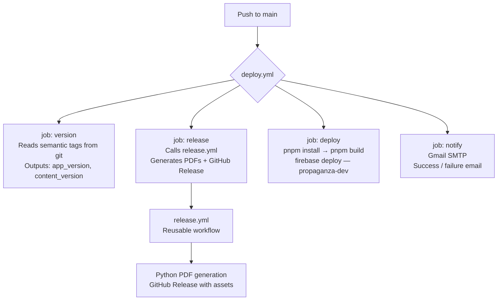
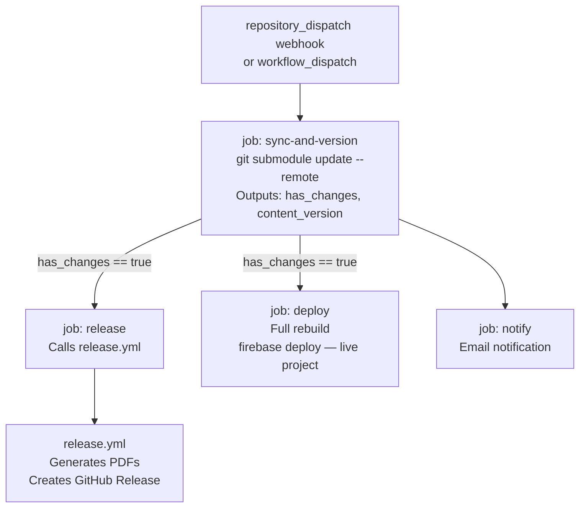
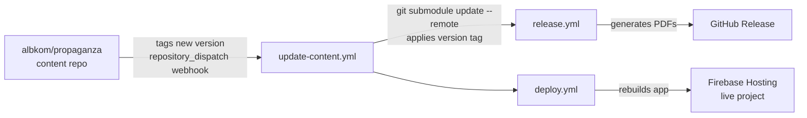

# Propaganza — Project Overview

> This document is intended as a technical reference for reviewers who do not have access to the private repository. It describes the architecture, tooling, deployment strategy, and CI/CD pipeline of the project.

> **💬 Don't want to read? Ask the doc.**
> This repository includes a RAG-powered chat interface — ask questions about the architecture, stack, or pipelines in plain English:
> **[project-propz-kl8m5a26jxaeqcqed6juym.streamlit.app](https://project-propz-kl8m5a26jxaeqcqed6juym.streamlit.app)**

---

## Why This Project Exists

Propaganza started as a collaborative project — a board game designed and built together with friends. The website and scoring app came later, as a companion enhancement to the game itself, but that's when things got interesting for me. Something clicked: I already knew exactly what I wanted to build and how, and I just exploded with creativity. The pipeline, the architecture, the deployment strategy — it all came together fast, driven by genuine excitement rather than obligation.

**The entire codebase was developed with AI as a core collaborator.** I used AI throughout — from architecture decisions and code generation to debugging, documentation, and CI/CD design. What you see here isn't just a side project: it's my day-to-day evidence of how I work with AI to ship production-grade software faster and with more intentionality than I could alone.

The result is a dual-app PWA (a score tracker + a marketing/rules site) built on Vue 3, deployed to Firebase via a fully automated GitHub Actions pipeline, served through Cloudflare, and maintained with a dual-version scheme that separates app releases from content releases. It's been running in production since 2024.

---

## Table of Contents

1. [The Game](#1-the-game)
2. [Propaganza App](#2-propaganza-app)
3. [Repository Structure](#3-repository-structure)
4. [Tech Stack](#4-tech-stack)
5. [Monorepo & Dependency Management](#5-monorepo--dependency-management)
6. [GitHub Actions — CI/CD Pipelines](#6-github-actions--cicd-pipelines)
7. [Docker & Local Development](#7-docker--local-development)
8. [Firebase Hosting & Deployment](#8-firebase-hosting--deployment)
9. [Cloudflare Integration](#9-cloudflare-integration)
10. [Git Submodule — Content Repo](#10-git-submodule--content-repo)
11. [Versioning Strategy](#11-versioning-strategy)
12. [PWA & Offline Support](#12-pwa--offline-support)
13. [Security & Secrets Management](#13-security--secrets-management)
14. [What I'm Proud Of](#14-what-im-proud-of)

---

## 1. The Game

Propaganza is a **satirical strategy board game for 2–4 players** set in a simulated universe. Players take on the role of shadowy **Manipulators** who, rather than fighting directly, secretly orchestrate four rival factions of conspiracy theorists — called *Dissidents* — to monopolize public opinion. No Manipulator is loyal to any faction; they exploit all four equally.

The four factions are deliberately absurdist caricatures:

| Faction | Symbol | Identity |
|---------|--------|---------|
| **Terratondisti** | ♦️ | Mystics convinced the Earth is spherical |
| **Spiegazionisti** | ♥️ | Rationalists searching for perfectly normal explanations |
| **Stagionisti** | ♣️ | Farmers who, since the seasons no longer exist, plant crops by the zodiac |
| **Antisimulazionisti** | ♠️ | Underground punks who deny the existence of the Simulation itself |

The game runs entirely off **two standard card decks** (Jokers included), which serve simultaneously as currency, combat power, and recruitment material. Each round has four phases: draw and trade cards, move units and declare attacks, resolve combat by playing card combinations, then recruit fighters and build Broadcast Towers. Victory points come from controlling key positions on the board and completing secret Objective Cards.

It blends resource management, card combinations, and area control at a BGG complexity of ~1.5–2, plays in 60–90 minutes, and is released under **CC-BY-NC-SA 4.0**.

---

## 2. Propaganza App

Propaganza App is a **board game companion suite** — a dual-application PWA paired with a marketing/rules website. The project is fully self-hosted (Firebase + Cloudflare), production-grade, and built by a small team.

### Applications

| App | Path | Purpose |
|-----|------|---------|
| **Scoring App** | `/app` | Mobile-first digital score tracker for game sessions |
| **Marketing Site** | `/` | Rules manual, downloads, game info (Italian-language) |

Both apps share authentication, CSS design tokens, and reusable Vue components via a `shared/` workspace package.

---

## 3. Repository Structure

```
propaganza-app/
├── app/                  # Scoring companion (Vue 3 + Vite, base: /app/)
│   ├── src/
│   │   ├── App.vue           # Auth gate (Firebase login check)
│   │   ├── AppContent.vue    # Main game UI shell
│   │   ├── components/       # SliderColumn, SatelliteMarker, GameHeader, …
│   │   ├── stores/game.js    # Pinia store — game state
│   │   └── main.js
│   ├── public/               # PWA assets (manifest.json, sw.js, icons)
│   └── vite.config.js
│
├── site/                 # Marketing site (Vue 3 + Vite, base: /)
│   ├── src/
│   │   ├── pages/            # HomePage, RulesPage, DownloadPage, AboutPage
│   │   ├── router.js         # Vue Router config
│   │   └── main.js
│   └── vite.config.js
│
├── shared/               # Cross-app workspace package
│   ├── components/           # PzLogo, PzMarkdown, PzModal, WikiRules
│   ├── composables/          # useCircleRotation, useGradientAnimation
│   ├── css/                  # Scoped CSS per app (app/, site/, auth/)
│   ├── firebase/             # config.js, useAuth.js
│   └── colors.css / tokens.css
│
├── content/              # Git submodule → albkom/propaganza
│   ├── rules/                # Markdown rule chapters (Italian)
│   ├── assets/               # Card art, faction symbols
│   └── .scripts/             # Python PDF build scripts
│
├── public/               # Root static assets (cover.png, sw.js, manifest.json)
├── scripts/              # PWA icon generation (generate-pwa-icons.mjs)
│
├── .github/
│   └── workflows/
│       ├── deploy.yml            # Main deploy pipeline (push to main)
│       ├── update-content.yml    # Content sync + redeploy pipeline
│       ├── release.yml           # Reusable release workflow (PDF generation)
│       └── upload_to_drive.yml   # Post-release Google Drive upload
│
├── Dockerfile            # Multi-stage build (Node 20 → Nginx Alpine)
├── docker-compose.yml    # Local dev (port 8888)
├── nginx.conf            # SPA routing for /app/ and /
├── firebase.json         # Firebase Hosting config (dev)
├── firebase.beta.json    # Firebase Hosting config (live/beta)
├── .firebaserc           # Project aliases (default: propaganza-dev, live: websites-a5878)
├── pnpm-workspace.yaml   # Workspace definition
└── package.json          # Root scripts and overrides
```

---

## 4. Tech Stack

### Frontend
| Layer | Technology |
|-------|-----------|
| UI Framework | Vue.js 3.4+ (Composition API) |
| Build Tool | Vite 6.4+ |
| Routing | Vue Router 4 (site only) |
| State Management | Pinia 2.1 (app only) |
| Markdown Rendering | markdown-it 14.1+ |
| Full-text Search | minisearch 7.2 |
| Image Processing | sharp 0.34 (PWA icon pipeline) |

### Backend / Infrastructure
| Layer | Technology |
|-------|-----------|
| Authentication | Firebase Auth |
| Hosting | Firebase Hosting (free tier) |
| CDN / SSL / DDoS | Cloudflare (free tier) |
| DNS | Custom domain `propaganza.it` via Cloudflare |
| Package Manager | pnpm 9 (workspaces) |
| Runtime | Node.js 20 |

### CI/CD & Tooling
| Tool | Role |
|------|------|
| GitHub Actions | All automation (build, deploy, release, notify) |
| Docker + Nginx | Local containerised dev environment |
| Python 3.11 | PDF generation from Markdown (via content scripts) |
| Firebase CLI | Hosting deployments |
| Gmail SMTP | Deployment notifications |
| Google Drive API | Post-release PDF upload |

---

## 5. Monorepo & Dependency Management

The project is a **pnpm workspace monorepo** with two publishable packages (`app`, `site`) and one internal package (`shared`).

```yaml
# pnpm-workspace.yaml
packages:
  - app
  - site
```

`shared/` is referenced directly by path — it is not published to a registry.

### Dependency overrides (security)

`package.json` enforces minimum patch versions across the entire workspace:

```json
"pnpm": {
  "overrides": {
    "esbuild": ">=0.25",
    "highlight.js": ">=10.4.1",
    "markdown-it": ">=12.3.2",
    "vite": ">=6.4.2"
  }
}
```

This ensures transitive dependency vulnerabilities are resolved even when sub-packages haven't updated their own `peerDependencies`.

### Root scripts

```bash
pnpm build           # builds site → dist/, then app → dist/app/
pnpm dev:site        # Vite dev server on :5174
pnpm dev:app         # Vite dev server on :5173
pnpm deploy          # build + firebase deploy (dev project)
pnpm deploy:beta:live  # build + firebase deploy (live production)
pnpm preview         # build + 15-minute Firebase preview channel
```

---

## 6. GitHub Actions — CI/CD Pipelines

There are four workflow files under `.github/workflows/`.

### `deploy.yml` — Main deployment pipeline

**Trigger:** Push to `main` when files under `app/src/**`, `site/src/**`, or `shared/**` change.



### `update-content.yml` — Content sync pipeline

**Trigger:** `repository_dispatch` webhook (sent by the content repo `albkom/propaganza` when new content is tagged) **or** manual `workflow_dispatch`.



### `release.yml` — Reusable release workflow

**Trigger:** `workflow_call` (called by `deploy.yml` and `update-content.yml`) or `workflow_dispatch` (manual).

**Inputs:** `app_version`, `content_version` (semantic tags, e.g. `v0.2.33`, `v0.2.4`)

```
inputs: app_version + content_version
    │
    ├── Checkout propaganza-app + content repo
    ├── Compute combined release tag: v{appVer}-{contentVer}
    │       → marks as prerelease if either tag contains "-preview"
    │       → deletes previous preview releases before creating new one
    │
    ├── Set up Python 3.11 + install requirements (cached by pip)
    │
    ├── Generate PDFs
    │       python content/.scripts/build.py --a5 --booklet
    │       python content/.scripts/build_cards.py
    │
    ├── Extract tag message from content repo (changelog notes)
    ├── Build release body from ChangelogTemplate.md
    │
    └── Create GitHub Release
            tag: v{appVer}-{contentVer}
            assets: content/output_pdfs/*.pdf
            prerelease: true/false
```

### `upload_to_drive.yml` — Post-release Google Drive upload

**Trigger:** `release` event (on published).

Uploads the PDF artifacts attached to a GitHub Release to a shared Google Drive folder, making game materials available to collaborators without requiring a GitHub account.

---

### Secrets inventory

| Secret | Used by |
|--------|---------|
| `APP_REPO_TOKEN` | Cross-repo checkout (content submodule, PAT) |
| `FIREBASE_SERVICE_ACCOUNT` | Firebase Hosting deployments |
| `VITE_FIREBASE_API_KEY` | Firebase SDK (injected at build time) |
| `VITE_FIREBASE_AUTH_DOMAIN` | Firebase SDK |
| `VITE_FIREBASE_PROJECT_ID` | Firebase SDK |
| `VITE_FIREBASE_STORAGE_BUCKET` | Firebase SDK |
| `VITE_FIREBASE_MESSAGING_SENDER_ID` | Firebase SDK |
| `VITE_FIREBASE_APP_ID` | Firebase SDK |
| `GMAIL_USERNAME` | Deployment notification emails |
| `GMAIL_APP_PASSWORD` | Deployment notification emails |
| `MAILING_LIST` | Notification recipients |

Firebase credentials are injected via `VITE_*` environment variables at Vite build time — they are never stored in the repository.

---

## 7. Docker & Local Development

Docker is provided for reviewers and contributors who want a production-like local environment without installing the full toolchain.

### Dockerfile (multi-stage)

```dockerfile
# Stage 1 — Builder
FROM node:20-alpine
# Enables pnpm via corepack
RUN corepack enable
WORKDIR /app
COPY . .
RUN pnpm install --frozen-lockfile
# Copies .env files for Vite build
RUN pnpm run build
# Output: /app/dist

# Stage 2 — Serve
FROM nginx:alpine
COPY --from=builder /app/dist /usr/share/nginx/html
COPY nginx.conf /etc/nginx/conf.d/default.conf
EXPOSE 80
CMD ["nginx", "-g", "daemon off;"]
```

### docker-compose.yml

```yaml
services:
  frontend-app:
    build: .
    ports:
      - "8888:80"
    restart: unless-stopped
```

Run with:

```bash
docker compose up --build
# App available at http://localhost:8888
```

### Nginx routing (`nginx.conf`)

The Nginx config handles two separate Vue Router apps served from the same container:

```
GET /app/*   → try_files $uri $uri/ /app/index.html
GET /*       → try_files $uri $uri/ /index.html
```

Both routes use the SPA fallback pattern so that Vue Router handles all client-side navigation. IPv6 is enabled for compatibility with Windows `localhost` resolution.

---

## 8. Firebase Hosting & Deployment

### Project aliases

| Alias | Firebase Project ID | Purpose |
|-------|-------------------|---------|
| `default` | `propaganza-dev` | Development / staging |
| `live` | `websites-a5878` | Production |

### Hosting rewrites (firebase.json)

```json
"rewrites": [
  { "source": "/app/**", "destination": "/app/index.html" },
  { "source": "**",      "destination": "/index.html"     }
]
```

Mirrors the Nginx config — both Vue Router apps receive their respective SPA fallbacks.

### Domain redirect (client-side)

Firebase's default domains (`*.web.app`, `*.firebaseapp.com`) bypass Cloudflare, which is undesirable (exposes origin, bypasses WAF). A blocking script in `index.html` handles this without requiring a paid Firebase plan:

```js
var h = location.hostname;
if (h !== 'localhost' && h !== 'propaganza.it' && h !== 'www.propaganza.it') {
  location.replace('https://propaganza.it' + location.pathname + location.search + location.hash);
}
```

The redirect runs before the Vue app mounts, preserving the original path, query string, and hash fragment.

---

## 9. Cloudflare Integration

The custom domain `propaganza.it` is proxied through Cloudflare, which provides:

- **SSL termination** — Full TLS from user to Cloudflare; Flexible/Full SSL to Firebase origin.
- **DDoS protection** — Cloudflare's free-tier WAF absorbs traffic spikes.
- **Caching** — Static assets (JS, CSS, images) are cached at Cloudflare edge nodes globally.
- **Access Control** — Cloudflare Access can be layered on for staging environments.

The `.web.app` and `.firebaseapp.com` Firebase URLs are never advertised publicly and are redirected client-side to the custom domain (see §7).

---

## 10. Git Submodule — Content Repo

Game content (rules, card art, assets) lives in a **separate private repository** (`albkom/propaganza`) and is linked to this repo as a git submodule at `content/`.

### Why a submodule?

- Game design iterations (rules revisions, new cards) happen on a different cadence than app code.
- Content contributors do not need write access to the app repo.
- PDF generation is triggered **from the app repo's CI**, but sources content at the pinned submodule SHA — ensuring reproducible builds.

### Submodule sync flow



---

## 11. Versioning Strategy

The project uses a **dual-version scheme**: one for the app, one for the content.

- App version: `v0.2.33` — driven by git tags on this repo.
- Content version: `v0.2.4` — driven by git tags on the content repo.
- Combined release tag: `v0.2.33-0.2.4` (published as a GitHub Release).

Preview/pre-release builds are suffixed with `-preview` and are automatically cleaned up (previous preview releases deleted) when a new preview is created, keeping the Releases page tidy.

Version metadata is injected into the built app via Vite's `define` (CSS custom properties `--pz-version`, `--pz-build-hash`, `--pz-build-date`), making the running version inspectable in devtools.

---

## 12. PWA & Offline Support

The scoring app is installed as a PWA on mobile devices.

- **`manifest.json`** — Declares app name, icons, display mode (`standalone`), theme colour.
- **`sw.js`** (Service Worker) — Caches app shell and static assets on first load; serves from cache when offline. This is essential for game sessions where internet connectivity is not guaranteed.
- **PWA icon pipeline** — `scripts/generate-pwa-icons.mjs` uses `sharp` to generate all required icon sizes from a single source SVG. This runs as a `prebuild` step.
- **Haptic feedback** — The app calls the Vibration API on touch interactions (score changes, drag events) to improve the board-game tactile feel on mobile.

---

## 13. Security & Secrets Management

| Concern | Approach |
|---------|---------|
| Firebase credentials | Never committed; injected as `VITE_*` env vars at CI build time |
| GitHub PAT | Stored as `APP_REPO_TOKEN` secret; used only for cross-repo actions |
| Domain exposure | Client-side redirect prevents Firebase `.web.app` URL from being usable |
| Dependency CVEs | `pnpm.overrides` pins minimum versions of known-vulnerable transitive deps |
| Firebase rules | Auth-gated; only authenticated users can read/write user data |
| Git hooks | Pre-push hook enforces version bump tagging before `git push` |

---

## 14. What I'm Proud Of

This isn't a tutorial project or a portfolio toy — it's software that gets used at a table with real people, which changes how you think about quality.

**The CI/CD pipeline is genuinely hands-free.** From a `git push` to a live production deploy with versioned PDF artifacts uploaded to Google Drive, zero manual steps are required. The content repo and app repo are decoupled but coordinated via webhooks — a design decision that took several iterations to get right, and one I worked through with AI as a thinking partner.

**The dual-version scheme solves a real problem.** Game rules evolve on a different cadence than app code. Treating them as separate versioned artifacts — with a combined release tag — means a rules update doesn't require an app release, and vice versa. It's a small design decision that made the whole project easier to maintain.

**The Cloudflare/Firebase combination is zero-cost production infrastructure.** The project runs on entirely free tiers: Firebase Hosting, Cloudflare free plan, GitHub Actions free minutes. The client-side domain redirect that forces all traffic through Cloudflare (bypassing Firebase's default URLs) was a creative constraint solution — no paid plan needed.

**AI was a genuine accelerator, not a crutch.** I used AI throughout the development of this project — to reason through architecture trade-offs, generate boilerplate, debug CI YAML, and write this document. The value wasn't in having AI write code for me, but in being able to iterate faster, ask "what are the failure modes of this approach?", and get a second opinion at 11pm when no one else is online. The result is a codebase that's more coherent and better documented than it would have been otherwise.

---

*Document generated from source inspection of the private repository. Last updated: April 2026.*

test pipeline generate-pdf 1