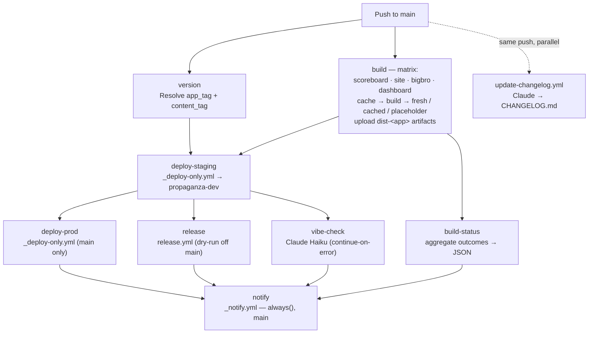
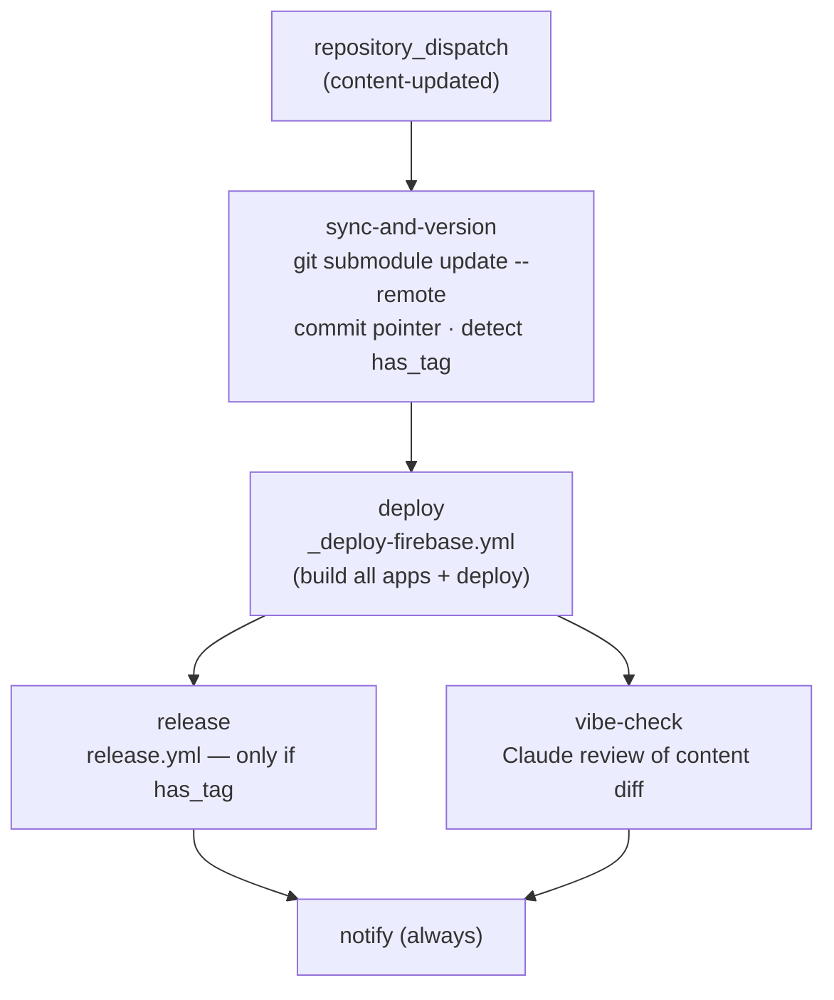
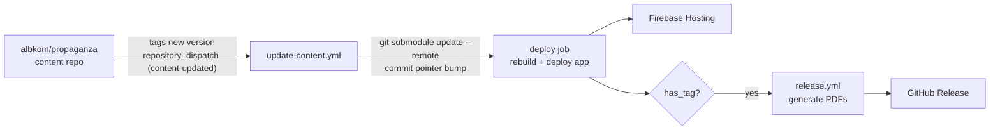

# Propaganza — Project Overview

> This document is intended as a technical reference for reviewers who do not have access to the private repository. It describes the architecture, tooling, deployment strategy, and CI/CD pipeline of the project.

---

## Why This Project Exists

Propaganza started as a collaborative project — a board game designed and built together with friends. The website and scoring app came later, as a companion enhancement to the game itself, but that's when things got interesting for me. Something clicked: I already knew exactly what I wanted to build and how, and I just exploded with creativity. The pipeline, the architecture, the deployment strategy — it all came together fast, driven by genuine excitement rather than obligation.

**The entire codebase was developed with AI as a core collaborator.** I used AI throughout — from architecture decisions and code generation to debugging, documentation, and CI/CD design. What you see here isn't just a side project: it's my day-to-day evidence of how I work with AI to ship production-grade software faster and with more intentionality than I could alone.

What began as a dual-app PWA has grown into a **multi-app suite** — a companion score tracker, a marketing/rules site, a campaign landing page, a networked match tracker, an admin dashboard, and a browser-playable digital version of the game — all built on Vue 3, deployed to Firebase via fully automated GitHub Actions pipelines, served through Cloudflare, and maintained with a dual-version scheme that separates app releases from content releases. It's been running in production since 2026.

---

## Table of Contents

1. [The Game](#1-the-game)
2. [Propaganza App](#2-propaganza-app)
3. [Repository Structure](#3-repository-structure)
4. [Tech Stack](#4-tech-stack)
5. [Monorepo & Dependency Management](#5-monorepo--dependency-management)
6. [GitHub Actions — CI/CD Pipelines](#6-github-actions--cicd-pipelines)
7. [Docker & Local Development](#7-docker--local-development)
8. [Firebase Hosting & Deployment](#8-firebase-hosting--deployment)
9. [Cloudflare Integration](#9-cloudflare-integration)
10. [Git Submodule — Content Repo](#10-git-submodule--content-repo)
11. [Versioning & Changelog Strategy](#11-versioning--changelog-strategy)
12. [PWA & Offline Support](#12-pwa--offline-support)
13. [Security & Secrets Management](#13-security--secrets-management)
14. [What I'm Proud Of](#14-what-im-proud-of)

---

## 1. The Game

Propaganza is a **satirical strategy board game for 2–4 players** set in a simulated universe. Players take on the role of shadowy **Manipulators** who, rather than fighting directly, secretly orchestrate four rival factions of conspiracy theorists — called *Dissidents* — to monopolize public opinion. No Manipulator is loyal to any faction; they exploit all four equally.

The four factions are deliberately absurdist caricatures:

| Faction | Symbol | Identity |
|---------|--------|---------|
| **Terratondisti** | ♦️ | Mystics convinced the Earth is spherical |
| **Spiegazionisti** | ♥️ | Rationalists searching for perfectly normal explanations |
| **Stagionisti** | ♣️ | Farmers who, since the seasons no longer exist, plant crops by the zodiac |
| **Antisimulazionisti** | ♠️ | Underground punks who deny the existence of the Simulation itself |

The game runs entirely off **two standard card decks** (Jokers included), which serve simultaneously as currency, combat power, and recruitment material. Each round has four phases: draw and trade cards, move units and declare attacks, resolve combat by playing card combinations, then recruit fighters and build Broadcast Towers. Victory points come from controlling key positions on the board and completing secret Objective Cards.

It blends resource management, card combinations, and area control at a BGG complexity of ~1.5–2, plays in 60–90 minutes, and is released under **CC-BY-NC-SA 4.0**.

---

## 2. Propaganza App

Propaganza App is a **board game companion suite** — a pnpm monorepo of several Vue 3 applications paired with a shared component library and a PDF generation pipeline. The project is fully self-hosted (Firebase + Cloudflare), production-grade, and built by a small team.

### Applications

| App | Workspace dir | Served at | Purpose |
|-----|---------------|-----------|---------|
| **Companion (Scoreboard)** | `scoreboard/` | `/scoreboard` | Mobile-first PWA score tracker + rules manual for game sessions |
| **Marketing Site** | `site/` | `/` | Rules manual, downloads, game info (Italian-language) |
| **Landing** | `landing/` | separate hosting target | Campaign / pre-launch landing page |
| **BigBro** | `bigbro/` | `/bigbro` | Networked multiplayer match tracker (Firestore lobby + presence) |
| **Dashboard** | `dashboard/` | `/dashboard` | Admin / analytics dashboard |
| **Digital Game** | `game/` | `/game` | Browser-playable game engine (vs Bot; online play scaffolded) |

Two non-application workspace packages support them:

| Package | Role |
|---------|------|
| **`shared/`** | Cross-app components, composables, CSS design tokens, and Firebase helpers (auth, Firestore sessions) |
| **`print/`** | PDF generation tooling for game materials (rulebook, cards, *Carte Maraviglia*) |

All apps share authentication, CSS design tokens, and reusable Vue components via the `shared/` workspace package.

---

## 3. Repository Structure

```
propaganza-app/
├── scoreboard/           # Companion score-tracker PWA (Vue 3 + Vite, base: /scoreboard/)
│   ├── src/
│   │   ├── stores/game.js    # Pinia store — local game state (START_VAL = 2)
│   │   ├── components/        # SliderColumn, PlayerSelectModal, GameHeader, …
│   │   └── main.js
│   ├── public/               # PWA assets (manifest.json, sw.js, icons)
│   └── vite.config.js
│
├── site/                 # Marketing site (Vue 3 + Vite + Vue Router, base: /)
├── landing/              # Campaign landing page (Vue 3 + Vite)
├── bigbro/               # Networked match tracker (Vue 3 + Vite + Firestore)
│   └── src/              # SetupWizard, SessionLobby, JoinSession (invite-code lobby)
├── dashboard/            # Admin / analytics dashboard (Vue 3 + Vite)
├── game/                 # Digital game engine (Vue 3 + TypeScript)
│   └── src/              # DigitalGame.vue, useGameStore.ts, core/ (cards, bot)
│
├── shared/               # Cross-app workspace package
│   ├── components/           # PzLogo, PzMarkdown, PzModal, WikiRules
│   ├── composables/          # useCircleRotation, useGradientAnimation
│   ├── firebase/             # config.js, useAuth.js, useSessions.js
│   ├── css/                  # Scoped CSS per app
│   └── colors.css / tokens.css
│
├── print/                # PDF generation package (rulebook, cards, Maraviglia)
├── scripts/              # TS build scripts (build/index.ts, rulebook.ts, cards.ts) run via tsx
│
├── content/              # Git submodule → albkom/propaganza (rules, card art, assets)
│
├── .taskfiles/           # Task runner definitions, split by concern
│   ├── Taskfile.dev.yml      # dev servers
│   ├── Taskfile.build.yml    # workspace builds + PDF generation
│   ├── Taskfile.docker.yml   # docker compose helpers
│   └── Taskfile.deploy.yml   # firebase deploy / preview channels
│
├── .internal/            # Internal docs: PIPELINES.md, decision-log/ (ADRs)
│
├── .github/
│   └── workflows/
│       ├── deploy.yml             # Main deploy pipeline (push to main)
│       ├── update-content.yml     # Content submodule sync + redeploy (repository_dispatch)
│       ├── release.yml            # Reusable release workflow (PDF generation + GitHub Release)
│       ├── update-changelog.yml   # Claude-generated CHANGELOG entries
│       ├── upload_to_drive.yml    # Post-release Drive upload + community email
│       ├── deploy-landing.yml     # Standalone landing-page deploy (manual)
│       ├── deploy-dev-manual.yml  # Deploy any branch to dev (manual)
│       └── _deploy-firebase.yml / _deploy-only.yml / _notify.yml  # reusable helpers
│
├── Taskfile.yml          # Root Task runner (install + includes .taskfiles/)
├── Dockerfile            # Multi-stage build (Node 22 builder → Nginx Alpine)
├── docker-compose.yml    # Local dev (prod-like + dev/test profiles + Firebase emulator)
├── nginx.conf            # SPA routing for all apps
├── firebase.json         # Firebase Hosting (2 targets) + Emulator Suite config
├── firestore.rules       # Cloud Firestore security rules
├── .firebaserc           # Project aliases + hosting targets
├── pnpm-workspace.yaml   # Workspace definition + overrides + allowBuilds
└── package.json          # Root scripts and dependency overrides
```

---

## 4. Tech Stack

### Frontend
| Layer | Technology |
|-------|-----------|
| UI Framework | Vue.js 3.4+ (Composition API) |
| Build Tool | Vite 6.4+ |
| Language | JavaScript + TypeScript (game engine, build scripts) |
| Routing | Vue Router 4 |
| State Management | Pinia (scoreboard) / a reactive TS store (game engine) |
| Markdown Rendering | markdown-it 14.1 |
| Full-text Search | minisearch 7.2 |
| Realtime / Data | Cloud Firestore (BigBro multiplayer lobby & presence) |

### Backend / Infrastructure
| Layer | Technology |
|-------|-----------|
| Authentication | Firebase Auth |
| Database | Cloud Firestore |
| Hosting | Firebase Hosting (free tier, 2 targets) |
| CDN / SSL / DDoS | Cloudflare (free tier) |
| DNS | Custom domain `propaganza.it` via Cloudflare |
| Package Manager | pnpm 9 (workspaces) |
| Task Runner | Task (`taskfile.dev`) |
| Runtime | Node.js 20 (CI/dev), Node 22 (Docker build) |

### CI/CD & Tooling
| Tool | Role |
|------|------|
| GitHub Actions | All automation (build, deploy, release, changelog, notify) |
| Docker + Nginx | Local containerised dev environment + Firebase Emulator |
| Firebase Emulator Suite | Local Auth + Firestore (`demo-local` project) |
| tsx + Puppeteer + pdf-lib | PDF generation from Markdown game content |
| Firebase CLI | Hosting deployments + preview channels |
| Claude (Anthropic) Haiku | CI vibe-check + auto-generated changelog entries |
| Gmail SMTP | Deploy notifications + community announcement emails |
| Google Drive API | Post-release PDF upload |

---

## 5. Monorepo & Dependency Management

The project is a **pnpm workspace monorepo** with several application packages, a shared internal library, and a PDF-generation package.

```yaml
# pnpm-workspace.yaml
packages:
  - shared
  - scoreboard
  - site
  - landing
  - bigbro
  - dashboard
  - game
  - print
```

`shared/` is referenced directly by path — it is not published to a registry.

### Dependency overrides (security)

`package.json` / `pnpm-workspace.yaml` enforce minimum patch versions across the entire workspace, resolving transitive-dependency CVEs even when sub-packages haven't bumped their own ranges:

```json
"overrides": {
  "esbuild@<=0.24.2": ">=0.25.0",
  "highlight.js@>=9.0.0 <10.4.1": ">=10.4.1",
  "markdown-it@<12.3.2": ">=12.3.2",
  "protobufjs@<7.5.5": ">=7.5.5",
  "vite@<=6.4.1": ">=6.4.2",
  "vue@>=2.0.0-alpha.1 <3.0.0-alpha.0": ">=3.0.0-alpha.0"
}
```

An `allowBuilds` allowlist gates which packages may run install scripts (`sharp`, `esbuild`, `puppeteer`, `@firebase/util`, …), so native postinstall steps only run where intended.

### Task runner & root scripts

Day-to-day commands go through **Task** (`taskfile.dev`), with the root `Taskfile.yml` including the per-concern files under `.taskfiles/`:

```bash
task install          # install all workspace dependencies
task dev              # run scoreboard + site + landing + bigbro in parallel
task build:build      # build all apps (site + scoreboard + bigbro + dashboard)
task build:fast       # quick build of just site + scoreboard
task deploy:deploy    # build + firebase deploy (propaganza-dev)
task deploy:preview   # build + 15-minute Firebase preview channel
task docker:dev       # docker compose --profile dev up --build
```

The equivalent raw pnpm scripts remain available (`pnpm build`, `pnpm dev:scoreboard`, `pnpm --dir <pkg> build`, …).

---

## 6. GitHub Actions — CI/CD Pipelines

The automation is built around **two entry-point pipelines** that converge on a shared, reusable release workflow, plus several independent utilities. (The workflow YAML under `.github/workflows/` is the source of truth; the prose in `.internal/PIPELINES.md` and `.github/workflows/WORKFLOWS.md` can lag behind it.)

| Workflow | Trigger | Role |
|----------|---------|------|
| `deploy.yml` | Push to `main` (app/site/shared code) | Version → Build (matrix) → Deploy (staging → prod) → Release |
| `update-content.yml` | `repository_dispatch` from content repo | Sync content submodule → Deploy → Release (if tagged) |
| `release.yml` | `workflow_call` (reusable) / manual | Generate PDFs + publish GitHub Release (or dry-run) |
| `update-changelog.yml` | Push to `main` (parallel) | Claude generates a `CHANGELOG.md` entry |
| `upload_to_drive.yml` | `release: published` | Upload PDFs to Google Drive + community email |
| `deploy-landing.yml` | Manual | Standalone landing-page deploy |
| `deploy-dev-manual.yml` | Manual (branch input) | Deploy any branch to the dev project |

> Note: in both main pipelines, **`release` now runs *after* the deploy**, not before — the app ships first, then the release artifacts are cut from the deployed version.

Three reusable helpers factor out the shared steps: **`_deploy-firebase.yml`** (build all apps *then* deploy), **`_deploy-only.yml`** (deploy already-built artifacts without rebuilding), and **`_notify.yml`** (render and send the status email).

### `deploy.yml` — Main deployment pipeline

**Trigger:** Push to `main` touching `scoreboard/src/**`, `site/src/**`, `bigbro/src/**`, `dashboard/src/**`, or `shared/**` (also manual `workflow_dispatch`). A guard (`if: github.actor != 'github-actions[bot]'`) skips the changelog bot's own commits, and a `concurrency` group serialises overlapping deploys. The pipeline **builds once, promotes the artifacts staging → prod, then cuts the release**:



- **`version`** — checks out the app + content repos and resolves the latest *stable* semver tag of each (`app_tag`, `content_tag`). The app tag is placed by the pre-push hook before the workflow fires.
- **`build`** *(matrix: scoreboard, site, bigbro, dashboard)* — the resilience layer. Each leg hashes its `src/` + `shared/` + `content/`, restores the **last-good build** from cache (an exact hash hit skips the rebuild entirely), then builds with `continue-on-error`. The outcome resolves to one of:
  - **fresh** — build succeeded, or an exact cache hit (source unchanged)
  - **cached** — build failed, but a previous good build was restored as fallback
  - **placeholder** — build failed with no cache → a small *"Sezione in manutenzione"* maintenance page is shipped instead

  Each leg uploads its compiled `dist-<app>` artifact. Because legs are independent and best-effort, **a single app's build failure never blocks the others or the deploy.**
- **`build-status`** — aggregates the per-app fresh/cached/placeholder markers into a JSON map, so the notification email can flag a degraded deploy.
- **`deploy-staging`** — calls `_deploy-only.yml`, which **downloads the pre-built `dist-*` artifacts and deploys them without rebuilding** to `propaganza-dev`.
- **`deploy-prod`** — runs only on `main` after staging succeeds; promotes the *same* artifacts to the default Firebase project (target `propaganza`).
- **`release`** — runs **after `deploy-staging` succeeds** (the deploy comes first now). Calls `release.yml` with `dry_run: true` on non-`main` refs, so PDFs are still generated but no GitHub Release is published unless the push is on `main`.
- **`vibe-check`** — `main` only; sends the commit diff to Claude Haiku for a rated snark; `continue-on-error: true` so it never blocks anything.
- **`notify`** — runs `always()` on `main`; renders a per-job ✅/❌/⏭️ status table (`version`, `build`, `deploy-staging`, `deploy-prod`, `release`, `vibe-check`) plus the build-status detail, and emails the mailing list via Gmail SMTP.

### `update-content.yml` — Content sync pipeline

**Trigger:** `repository_dispatch` (`content-updated`) sent by the content repo `albkom/propaganza`, or manual `workflow_dispatch`.



- **`sync-and-version`** — advances the `content` submodule pointer, commits it, and detects whether the new content commit is an *exact tagged release* (`has_tag`).
- **`deploy`** — calls `_deploy-firebase.yml`, which **builds all apps and then deploys** (this path rebuilds, unlike `deploy.yml`'s artifact promotion).
- **`release`** — runs **after `deploy` succeeds**, and only when `has_tag == 'true'` (a real content release, not a routine commit).
- **`vibe-check` / `notify`** — same Claude-snark and always-notify pattern as `deploy.yml`.

### `release.yml` — Reusable release workflow

**Trigger:** `workflow_call` (from `deploy.yml` / `update-content.yml`) or `workflow_dispatch`.

**Inputs:** `app_version`, `content_version` (semantic tags, e.g. `v0.2.33`, `v0.2.4`), and `dry_run` (generate PDFs but skip publishing).

```
inputs: app_version + content_version + dry_run
    │
    ├── Compute combined release tag: v{app}-{content}
    │       → prerelease if either tag contains "-preview"
    │       → delete previous preview releases first  (preview, non-dry-run only)
    │
    ├── Set up Node + pnpm install (+ cached Puppeteer Chrome)
    ├── Generate PDFs — pnpm --dir print run build -- --version <tag> [--watermark]
    ├── Read content-repo tag message → fill content/templates/ChangelogTemplate.md
    │
    └── Create GitHub Release   (SKIPPED when dry_run == true)
            tag: v{app}-{content}; assets: output_pdfs/*.pdf; prerelease = is_preview
```

`dry_run` is how `deploy.yml` keeps non-`main` pushes from publishing releases: PDFs are still built (catching breakage early), but no GitHub Release or tag is created.

### `update-changelog.yml` — Auto-generated changelog

Runs in parallel with `deploy.yml` on every `main` push touching source or workflow files. Collects commits since the last changelog update, asks **Claude Haiku** to write a human-friendly Markdown entry (or `SKIP`), and prepends it to `CHANGELOG.md`. Two guards prevent infinite loops: it skips bot commits and its own `chore: update changelog` commits.

### `upload_to_drive.yml` — Post-release distribution

Fires on `release: published`. Downloads the release's PDF assets, uploads them to a shared **Google Drive** folder, appends idempotent Drive links to the release notes, and — if a Firestore subscriber waitlist is non-empty — sends a rendered HTML **community announcement email** via Gmail SMTP (BCC).

### Standalone manual workflows

- **`deploy-landing.yml`** — builds and deploys only the landing page to its Firebase hosting target.
- **`deploy-dev-manual.yml`** — builds any branch and ships it to `propaganza-dev` (no tagging, no release, no email) for staging.

---

### Secrets inventory

| Secret | Used by |
|--------|---------|
| `APP_REPO_TOKEN` | Cross-repo checkout of the private content repo (PAT) |
| `GITHUB_TOKEN` | GitHub API ops (releases, tags) |
| `FIREBASE_SERVICE_ACCOUNT` | Firebase Hosting deploys + Firestore access |
| `VITE_FIREBASE_*` | Firebase SDK config, injected at Vite build time |
| `ANTHROPIC_API_KEY` | Claude Haiku — vibe-check + changelog generation |
| `GOOGLE_OAUTH_CREDENTIALS` | Google Drive API (release PDF upload) |
| `DRIVE_FOLDER_ID` | Target Drive folder for uploads |
| `GMAIL_USERNAME` / `GMAIL_APP_PASSWORD` | SMTP for deploy + community emails |
| `MAILING_LIST` | Internal deploy-notification recipients |

Firebase credentials are injected via `VITE_*` environment variables at Vite build time — they are never stored in the repository.

---

## 7. Docker & Local Development

Docker provides a production-like environment and a full hot-reload dev stack — including the Firebase Emulator — without installing the toolchain on the host.

### Dockerfile (multi-stage)

```dockerfile
# Stage 1 — Builder (Node 22 Alpine, pnpm via corepack)
FROM node:22-alpine AS builder
WORKDIR /app
RUN corepack enable && apk add --no-cache git
# Copy manifests first for a cache-friendly install layer
COPY package.json pnpm-lock.yaml pnpm-workspace.yaml ./
COPY shared/package.json scoreboard/package.json site/package.json \
     bigbro/package.json landing/package.json dashboard/package.json ./<pkg>/
RUN pnpm install --frozen-lockfile
COPY . .
# Firebase config arrives as build ARGs → exposed as VITE_* ENV for `vite build`
RUN pnpm run build      # builds site, scoreboard, bigbro, dashboard → dist/

# Stage 2 — Serve
FROM nginx:alpine
COPY --from=builder /app/dist /usr/share/nginx/html
COPY nginx.conf /etc/nginx/conf.d/default.conf
EXPOSE 80
CMD ["nginx", "-g", "daemon off;"]
```

### docker-compose.yml — three modes via profiles

```bash
# Production-like — all apps built and served from one nginx container
docker compose up --build
# → http://localhost:8080

# Development — hot-reload Vite dev servers + Firebase Emulator
docker compose --profile dev up
# → :5173 scoreboard · :5174 site · :5175 bigbro · :5176 landing · :5177 dashboard
# → :4000 Emulator UI · :9099 Auth · :8080 Firestore

# Emulator only (integration tests without the apps)
docker compose --profile test up firebase-emulator
```

Each dev service runs one Vite dev server. **Named volumes** isolate the Linux container's `node_modules` from the Windows host's, avoiding native-binary conflicts. The emulator runs under the `demo-local` project (a Firebase convention that needs no login), persisting state to a named `emulator-data` volume via `--import` / `--export-on-exit`.

### Nginx routing (`nginx.conf`)

A single container serves every app, each with its own SPA fallback so Vue Router handles client-side navigation:

```
GET /            → /index.html              (marketing site)
GET /scoreboard  → /scoreboard/index.html   (companion app)
GET /bigbro      → /bigbro/index.html       (match tracker)
GET /dashboard   → /dashboard/index.html    (admin dashboard)
GET /landing     → /landing/index.html      (landing page)
```

IPv6 listening is enabled for Windows `localhost` resolution, and `absolute_redirect off` preserves the external Docker port in redirects.

---

## 8. Firebase Hosting & Deployment

### Project aliases

| Alias | Firebase Project ID | Purpose |
|-------|-------------------|---------|
| `default` | `propaganza-dev` | Development / staging |
| `live` | `websites-a5878` | Production |

### Hosting targets (`.firebaserc` + `firebase.json`)

Production hosts two targets: **`propaganza`** (the main suite) and **`propaganza-landing`** (the landing page), each deployable independently.

```json
// firebase.json — propaganza target rewrites
"rewrites": [
  { "source": "/scoreboard/**", "destination": "/scoreboard/index.html" },
  { "source": "/bigbro/**",     "destination": "/bigbro/index.html" },
  { "source": "/dashboard/**",  "destination": "/dashboard/index.html" },
  { "source": "/game/**",       "destination": "/game/index.html" },
  { "source": "**",             "destination": "/index.html" }
]
```

This mirrors the Nginx config — every Vue Router app receives its own SPA fallback. The same `firebase.json` also declares the **Emulator Suite** ports (Auth 9099, Firestore 8080, UI 4000) and points Firestore at `firestore.rules`.

### Domain redirect (client-side)

Firebase's default domains (`*.web.app`, `*.firebaseapp.com`) bypass Cloudflare, which is undesirable (exposes origin, bypasses WAF). A blocking script in `index.html` handles this without requiring a paid Firebase plan:

```js
var h = location.hostname;
if (h !== 'localhost' && h !== 'propaganza.it' && h !== 'www.propaganza.it') {
  location.replace('https://propaganza.it' + location.pathname + location.search + location.hash);
}
```

The redirect runs before the Vue app mounts, preserving the original path, query string, and hash fragment. It is a client-side convenience, not a hard security boundary.

---

## 9. Cloudflare Integration

The custom domain `propaganza.it` is proxied through Cloudflare, which provides:

- **SSL termination** — Full TLS from user to Cloudflare; Flexible/Full SSL to Firebase origin.
- **DDoS protection** — Cloudflare's free-tier WAF absorbs traffic spikes.
- **Caching** — Static assets (JS, CSS, images) are cached at Cloudflare edge nodes globally.
- **Access Control** — Cloudflare Access can be layered on for staging environments.

The `.web.app` and `.firebaseapp.com` Firebase URLs are never advertised publicly and are redirected client-side to the custom domain (see §8).

---

## 10. Git Submodule — Content Repo

Game content (rules, card art, assets) lives in a **separate private repository** (`albkom/propaganza`) and is linked to this repo as a git submodule at `content/`.

### Why a submodule?

- Game design iterations (rules revisions, new cards) happen on a different cadence than app code.
- Content contributors do not need write access to the app repo.
- PDF generation is triggered **from the app repo's CI**, but sources content at the pinned submodule SHA — ensuring reproducible builds.

### Submodule sync flow



---

## 11. Versioning & Changelog Strategy

The project uses a **dual-version scheme**: one for the app, one for the content.

- App version: `v0.2.33` — driven by git tags on this repo (the pre-push hook enforces a tag before push).
- Content version: `v0.2.4` — driven by git tags on the content repo.
- Combined release tag: `v0.2.33-0.2.4` (published as a GitHub Release).

Preview/pre-release builds are suffixed with `-preview`, watermarked in the generated PDFs, and automatically cleaned up (previous preview releases deleted) when a new preview is created — keeping the Releases page tidy.

A separate **`CHANGELOG.md`** is maintained automatically: `update-changelog.yml` collects commits since the last update and has Claude Haiku draft a human-readable entry on every `main` push. Version metadata is also injected into the built apps at build time, making the running version inspectable in devtools.

---

## 12. PWA & Offline Support

The companion scoreboard app is installed as a PWA on mobile devices.

- **`manifest.json`** — Declares app name, icons, display mode (`standalone`), theme colour.
- **`sw.js`** (Service Worker) — Caches app shell and static assets on first load; serves from cache when offline. This is essential for game sessions where internet connectivity is not guaranteed.
- **PWA icon pipeline** — `sharp` generates all required icon sizes from a single source SVG as a `prebuild` step.
- **Haptic feedback** — The app calls the Vibration API on touch interactions (score changes, drag events) to improve the board-game tactile feel on mobile.

The BigBro tracker and digital game additionally persist state — BigBro to **Cloud Firestore** (multiplayer sessions, presence) and the game engine to `localStorage` (single-device sessions survive reload).

---

## 13. Security & Secrets Management

| Concern | Approach |
|---------|---------|
| Firebase credentials | Never committed; injected as `VITE_*` env vars at CI build time |
| GitHub PAT | Stored as `APP_REPO_TOKEN` secret; used only for cross-repo actions |
| Third-party API keys | `ANTHROPIC_API_KEY`, `GOOGLE_OAUTH_CREDENTIALS` held as repo secrets only |
| Domain exposure | Client-side redirect prevents Firebase `.web.app` URL from being usable |
| Dependency CVEs | `pnpm` overrides pin minimum versions of known-vulnerable transitive deps |
| Firestore rules | `firestore.rules` is auth-gated; only authenticated users read/write their data |
| Local development | Firebase Emulator runs under a credential-free `demo-local` project |
| Git hooks | Pre-push hook enforces version-bump tagging before `git push` |

---

## 14. What I'm Proud Of

This isn't a tutorial project or a portfolio toy — it's software that gets used at a table with real people, which changes how you think about quality.

**The CI/CD pipeline is genuinely hands-free.** From a `git push` to a live production deploy with versioned PDF artifacts uploaded to Google Drive and a community announcement email sent to the waitlist, zero manual steps are required. The content repo and app repo are decoupled but coordinated via webhooks — a design decision that took several iterations to get right, and one I worked through with AI as a thinking partner.

**The dual-version scheme solves a real problem.** Game rules evolve on a different cadence than app code. Treating them as separate versioned artifacts — with a combined release tag — means a rules update doesn't require an app release, and vice versa. It's a small design decision that made the whole project easier to maintain.

**The Cloudflare/Firebase combination is zero-cost production infrastructure.** The project runs on entirely free tiers: Firebase Hosting, Cloudflare free plan, GitHub Actions free minutes. The client-side domain redirect that forces all traffic through Cloudflare (bypassing Firebase's default URLs) was a creative constraint solution — no paid plan needed.

**AI was a genuine accelerator, not a crutch.** I used AI throughout the development of this project — to reason through architecture trade-offs, generate boilerplate, debug CI YAML, write changelog entries, and produce this document. The value wasn't in having AI write code for me, but in being able to iterate faster, ask "what are the failure modes of this approach?", and get a second opinion at 11pm when no one else is online. The result is a codebase that's more coherent and better documented than it would have been otherwise.

---

*Document generated from source inspection of the private repository. Last updated: June 2026.*
